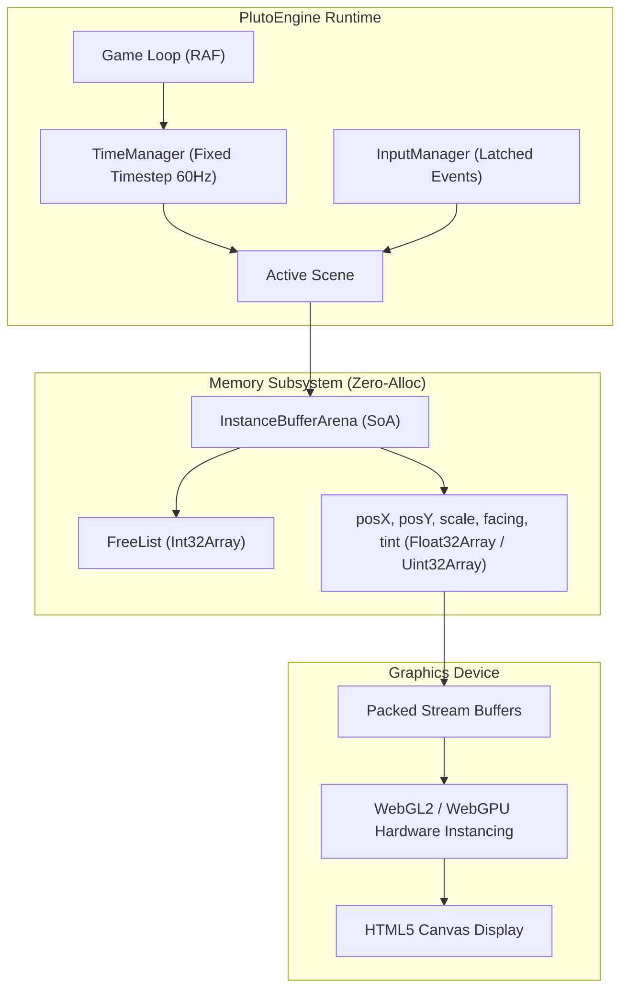

# Architecture Overview

The extreme performance of PlutoEngine is no accident. It is the result of a meticulously engineered **Data-Oriented Architecture** designed around CPU cache mechanics, browser JavaScript engine dynamics (V8 JIT / Garbage Collection), and GPU pipeline throughput.



---

## 1. InstanceBufferArena: Structure of Arrays (SoA)

Traditional Object-Oriented engines rely on an Array of Structures (AoS), creating isolated objects on the JavaScript heap:

```typescript
// ❌ Traditional AoS (Array of Structures)
// Memory fragments across heap, incurring massive GC overhead
interface Entity {
  x: number;      // 8 bytes
  y: number;      // 8 bytes
  scale: number;  // 8 bytes
  facing: number; // 8 bytes
  tint: number;   // 8 bytes
}
const entities: Entity[] = []; // Pointer indirection causes cache misses
```

PlutoEngine stores all entity data inside contiguous, flat TypedArrays (Structure of Arrays: SoA):

```typescript
//  PlutoEngine SoA (Structure of Arrays)
export class InstanceBufferArena {
  public readonly capacity: number;
  public readonly posX: Float32Array;
  public readonly posY: Float32Array;
  public readonly scale: Float32Array;
  public readonly facing: Float32Array;
  public readonly tint: Uint32Array;
  public readonly active: Uint8Array;
  // ...
}
```

### Why SoA Matters
1. **CPU Cache Line Maximization**: Modern CPUs fetch memory into L1/L2 caches in 64-byte cache lines. When iterating entity X coordinates in a contiguous `Float32Array`, a single fetch loads 16 coordinate floats (4 bytes × 16 = 64 bytes) directly into cache with zero stall time.
2. **SIMD & JIT Vectorization**: Sequential memory patterns enable the JavaScript JIT compiler to auto-vectorize critical math loops into SIMD CPU instructions.

---

## 2. O(1) Memory Lifecycle via the Free List

Spawning (`allocate`) and destroying (`free`) entities causes zero heap allocations. A stack-based **Free List** implemented with an `Int32Array` guarantees constant-time $O(1)$ operations with zero garbage collector involvement.

```typescript
// Free List Mechanics
public allocate(): number {
  if (this.freeListHead >= this.capacity) return -1; // Arena full
  const id = this.freeList[this.freeListHead++];
  this.active[id] = 1;
  // Initialize defaults
  this.posX[id] = 0;
  this.posY[id] = 0;
  return id;
}

public free(id: number): void {
  this.active[id] = 0;
  this.freeList[--this.freeListHead] = id; // Immediately return slot for recycling
}
```

When an enemy is defeated and `free(id)` is called, the ID index is pushed onto the Free List. In subsequent frames, new entities instantly recycle these memory slots.

---

## 3. Flyweight Handle Pattern

To avoid requiring developers to write raw array indexing everywhere, PlutoEngine provides lightweight `Sprite` handles:

```typescript
export class Sprite {
  public readonly id: number;
  private readonly _arena: InstanceBufferArena;

  constructor(id: number, arena: InstanceBufferArena) {
    this.id = id;
    this._arena = arena;
  }

  public get x(): number { return this._arena.posX[this.id]; }
  public set x(val: number) { this._arena.posX[this.id] = val; }

  public destroy(): void {
    this._arena.free(this.id);
  }
}
```

The `Sprite` instance does not carry state of its own; it acts as a zero-cost gateway into the underlying SoA memory arena.

---

## 4. Fixed Timestep & Variable Rendering Loop

The game loop decouples deterministic physics simulation from display refresh rates using an **accumulator-based fixed timestep**:

```
[ RequestAnimationFrame (Variable dt: 144Hz, 60Hz, etc.) ]
                  │
                  ▼
         TimeManager.step(now)
                  │
      ┌───────────┴───────────┐
      ▼                       ▼
  accumulator += dt     accumulator < fixedDt (1/60s)?
      │                       │
      │ (drain accumulator)   ▼
      └───> while(accumulator >= fixedDt)
                scene.fixedUpdate(1/60)
                  │
                  ▼
             scene.update(dt)
                  │
                  ▼
             scene.render()
```

- **`fixedUpdate(1/60)`**: Executes deterministic simulation passes such as XPBD physics constraints, collision detection, and AI behavior logic.
- **`update(dt)`**: Handles frame-dependent updates such as camera smoothing, tween interpolations, and high-refresh input handling.

---

## 5. Hardware Instanced Rendering Pipeline

Issuing individual draw calls for 100,000 sprites will choke any GPU driver. PlutoEngine uses **Hardware Instanced Drawing**: a single base quad mesh (4 vertices) is drawn $N$ times, with per-instance attributes (position, scale) streamed directly from the arena.

```typescript
// Single GPU draw call renders up to 100,000 instances
device.setupInstancedAttributes(gpuBuffers);
device.drawInstanced(renderCount);
```

The CPU packing step extracts only active entities (`active[i] === 1`) into continuous GPU staging arrays without allocating temporary arrays.

---

## 6. Zero-Allocation Golden Rules

To achieve maximum performance with PlutoEngine:

1. **No `new` in Critical Loops**: Allocate objects and buffers during setup/init, never in `update` or `fixedUpdate`.
2. **Avoid Object & Array Literals**: Pass scalar parameters (`x, y, radius`) directly rather than returning `{ x, y }` objects.
3. **Avoid Dynamic Closures**: Prefer standard `for` loops over `forEach`, `map`, or inline arrow functions in game loops.
4. **Clean up Resources**: Unsubscribe listeners and reset arenas when transitioning scenes.
