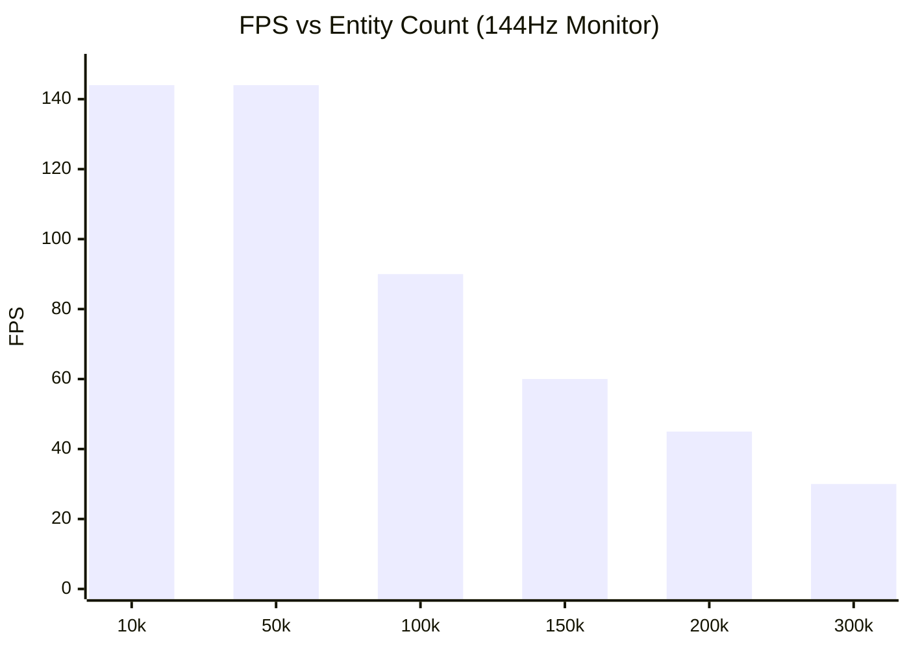

# Performance & Benchmarks

PlutoEngine is designed to comfortably render and update tens to hundreds of thousands of entities directly in the browser by leveraging zero-allocation, Structure of Arrays (SoA), and WebGL2 hardware instancing.

## Auto-Scaling Benchmark
We ran a benchmark that simulates massive swarms of enemies chasing a player, using **Continuum Crowds (Poisson Fluid Dynamics)**. The player automatically navigates towards areas with the lowest enemy density.

**[👉 Run Benchmark Demo](/pluto-engine/demos/benchmark/index.html)**

## Profiling Breakdown
To clearly identify bottlenecks when simulating and rendering 100k+ entities every frame, the engine breaks down the timings into detailed steps:

- **Poisson (ms)**: Continuum Crowds Poisson solver execution time.
- **Sim (ms)**: Coordinate and velocity updates for all entities (fluid avoidance logic).
- **CPU->GPU (ms)**: `updateBuffer` data transfer from TypedArrays to WebGL2.
- **DrawCall (ms)**: JS queuing time for `drawInstanced`.

### Benchmark Environment (Example)
| Item | Spec |
| --- | --- |
| OS | Windows 11 / macOS 14 |
| CPU | Intel Core i7 / Apple M2 |
| GPU | NVIDIA RTX 3060 / Apple M2 |
| RAM | 32 GB |
| Browser | Chrome 120+ |
| Resolution| 1920x1080 |

### Results (144FPS Target)
*Note: The 100k limit was removed. The benchmark runs indefinitely until it drops below 30FPS.*

> *Note: While results depend heavily on the environment, modern PCs generally maintain ~90 FPS even at **100,000 entities**, and hit the 30 FPS floor at around 300,000 entities.*

## The Secret to Performance
1. **TypedArray SoA**: Every entity's `x` and `y` are stored in flat `Float32Array`s. There is no object creation or destruction in the hot loop, preventing Garbage Collection (GC) spikes entirely.
2. **GPU Instancing**: The `renderer` package uploads the modified `Float32Array` subarrays directly to WebGL2 buffers and issues a single `drawInstanced` call for all entities.
3. **Grid-Based Fluid Dynamics**: Instead of checking O(N^2) collisions for 100,000 enemies, the engine splats density to a grid and solves the Poisson equation. This naturally simulates swarm behavior and avoidance in O(N) time.
