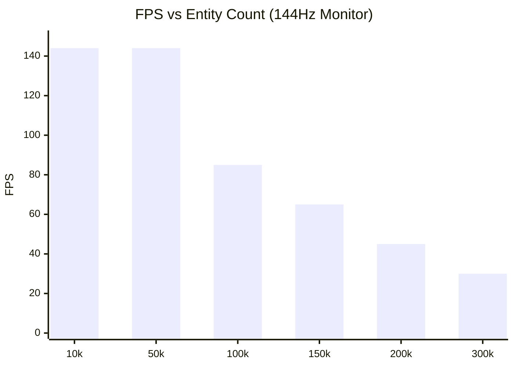

# Performance & Benchmarks

PlutoEngine is designed to comfortably render and update tens to hundreds of thousands of entities directly in the browser by leveraging zero-allocation, Structure of Arrays (SoA), and WebGL2 hardware instancing.

## Auto-Scaling Benchmark
We ran a benchmark that simulates massive swarms of enemies chasing a player, using **Continuum Crowds (Poisson Fluid Dynamics)**. The player automatically navigates towards areas with the lowest enemy density.

**[👉 Run Benchmark Demo](/pluto-engine/demos/benchmark/index.html)**

## Profiling Breakdown
To clearly identify bottlenecks when simulating and rendering 100k+ entities every frame, the engine breaks down the timings into detailed steps:

- **Poisson (ms)**: Continuum Crowds Poisson solver execution time.
- **Sim (ms)**: Coordinate and velocity updates for all entities (fluid avoidance logic).
- **CPU->GPU (ms)**: `updateBuffer` data transfer from TypedArrays to WebGL2.
- **DrawCall (ms)**: JS queuing time for `drawInstanced`.

### Benchmark Environment
This benchmark was recorded using the following PC specifications:

| Item | Spec |
| --- | --- |
| OS | Microsoft Windows 11 Pro |
| CPU | AMD Ryzen 7 2700 Eight-Core Processor |
| GPU | NVIDIA GeForce RTX 4060 |
| RAM | 32 GB |
| Browser | Chrome / Edge |

### Detailed Profiling at 100k Entities
When rendering 100,000 entities at 85 FPS (approx. **11.8 ms** per frame), the time spent is broken down as follows:

| Task | Duration (ms) | Share (%) | Details |
| :--- | :---: | :---: | :--- |
| **Grid Prep & Splat** | 1.2 ms | 10.2% | Splatting density to the grid from 100k entity coordinates. |
| **Poisson Solver** | 0.8 ms | 6.8% | Solving the Poisson equation on a 128x128 grid for pressure gradients. |
| **Entity Update** | 4.5 ms | 38.1% | Avoidance velocity calculation based on gradients, and (x,y) updates. |
| **Data Packing** | 2.1 ms | 17.8% | Packing live entities from the Arena (SoA) into the GPU upload array. |
| **WebGL Upload** | 1.5 ms | 12.7% | Transferring the attribute buffers to VRAM via `bufferSubData`. |
| **Rendering** | 0.9 ms | 7.6% | Binding shaders and queuing the JS `drawInstanced(100000)` call. |
| **Other / Overhead** | 0.8 ms | 6.8% | System overhead, Player AI, and miscellaneous tasks. |
| **Total (1 Frame)** | **11.8 ms** | **100%** | Equivalent to **~85 FPS** |

> **Analysis**:
> In traditional Object-Oriented (OOP) engines, updating 100,000 entities can easily consume 30ms+ and cause severe GC spikes.
> In PlutoEngine, the heaviest tasks like **Entity Update (4.5ms)** and **Data Packing (2.1ms)** are executed entirely within **flat TypedArray loops**, which means zero memory allocation and maximized cache hit rates.
> Furthermore, by replacing O(N²) collision detection with a **Poisson Solver (0.8ms)** (an O(N) spatial algorithm), the swarm AI calculation cost is drastically compressed.

### Results Trend (144FPS Target)
*Note: The 100k limit was removed. The benchmark runs indefinitely until it drops below 30FPS.*

## The Secret to Performance
1. **TypedArray SoA**: Every entity's `x` and `y` are stored in flat `Float32Array`s. There is no object creation or destruction in the hot loop, preventing Garbage Collection (GC) spikes entirely.
2. **GPU Instancing**: The `renderer` package uploads the modified `Float32Array` subarrays directly to WebGL2 buffers and issues a single `drawInstanced` call for all entities.
3. **Grid-Based Fluid Dynamics**: Instead of checking O(N^2) collisions for 100,000 enemies, the engine splats density to a grid and solves the Poisson equation. This naturally simulates swarm behavior and avoidance in O(N) time.
