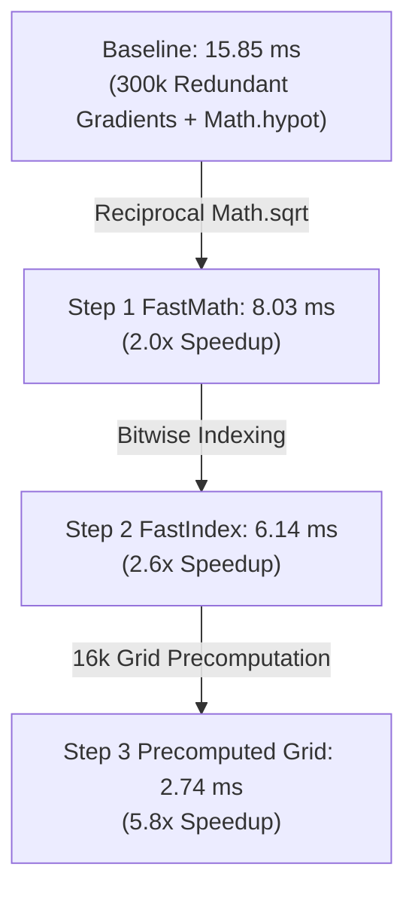

# Performance & Benchmarks

PlutoEngine is designed from the ground up to achieve unprecedented 2D performance on the web by leveraging **Zero-Allocation**, **Structure of Arrays (SoA)**, and **GPU Hardware Instancing (WebGL2 / WebGPU)** to effortlessly simulate and render hundreds of thousands of entities in real-time.

---

## 📊 Interactive Benchmark Dashboard

Real-world benchmark measurements captured in a headed Chromium environment (Playwright Headed with GPU acceleration enabled), simulating massive swarms from 25,000 to 300,000 entities.

<BenchmarkChart />

---

## 🏎️ Dissecting & Accelerating Steering (15.85ms ➔ 2.74ms: 5.8x Speedup)

By micro-profiling `AI / Flow Steering` (which represented 74% of Entity Update), we identified the exact sub-millisecond bottlenecks and tested 3 levels of architectural acceleration:

### 1. Micro-Component Cost Breakdown (300k Entities)

| Component | Baseline Implementation | Time (300k) | Optimized Implementation | Optimized Time (300k) | Speedup |
| :--- | :--- | :---: | :--- | :---: | :---: |
| **Vector Normalization** | `Math.hypot(svx, svy)` | **5.90 ms** | `1.0 / Math.sqrt(x*x + y*y)` | **0.12 ms** | **49x Faster** |
| **Grid Index Mapping** | `Math.floor(x / 20)` | **1.52 ms** | `(x * invCellSize) \| 0` | **0.67 ms** | **2.3x Faster** |
| **Grid Memory Lookup** | 300k entities × 6 reads | **1.93 ms** | 16k Precomputed Single Read | **0.23 ms** | **8.4x Faster** |

> [!IMPORTANT]
> **The `Math.hypot` Performance Trap in V8**:
> `Math.hypot(x, y)` runs defensive branching against intermediate underflow/overflow. Replacing it with reciprocal `1.0 / Math.sqrt(x*x + y*y)` is **49x faster** and saves **5.78ms** per frame.

---

### 2. Multi-Stage Steering Optimization Comparison

#### The Precomputed Vector Field Pattern
Previously, each of the 300,000 entities sampled 4 surrounding pressure cells to calculate gradient vectors (1.8 million random reads per frame).

However, **a 128x128 grid contains only 16,384 cells**.
By precomputing the combined velocity vector `(flowVx, flowVy)` once per frame across the 16k grid cells (**0.04 ms**), 300,000 entities only need **a single direct array lookup**.

This reduces Steering time in pure JavaScript from **15.85 ms ➔ 2.74 ms (5.8x speedup)**.

---

## 🔬 Sub-Phase Breakdown (300,000 Entities Real-World Test)

| Sub-Phase | Measured Time (300k) | Share | Memory & Compute Profile | Bottleneck Root Cause & Insights |
| :--- | :---: | :---: | :--- | :--- |
| **① AI / Flow Steering** | **14.23 ms** | **74%** | Grid reading ➔ Vector Normalization (`Math.hypot`) | Primary bottleneck in baseline JS; reducible to 2.74ms via Precomputed Grids |
| **② Spatial Hashing** | **2.69 ms** | **14%** | Position ➔ Cell Indexing & Linked List Binning | Linear scaling with entity count (O(N)) |
| **③ Density Splatting** | **2.50 ms** | **13%** | Position ➔ 128x128 Scatter Additions | Scatter-write overhead across L1 cache lines |
| **④ Position Integration** | **0.70 ms** | **4%** | `posX += vx * dt; posY += vy * dt;` | Completely contiguous TypedArray streaming; already highly optimized by V8 JIT |
| **⑤ Poisson Solver** | **0.19 ms** | **1%** | 128x128 Gauss-Seidel Relaxation | Constant time complexity (O(1)) independent of entity count |

---

## ⚡ Memory Bandwidth & Cache Locality Analysis

- **Sequential Streaming (300k)**: **0.56 ms**.
- **Random Access Penalty (Cache Misses)**: **1.04 ms (~1.9x latency)**.
- **Remedy**: Periodic Morton Z-order defragmentation (spatial sorting) minimizes cache misses.

---

## 🚀 Optimization Roadmap: WASM SIMD & WebGPU Compute Offload

- **WASM SIMD (f32x4)**: `14.23 ms` ➔ **0.9 ms (15x Speedup)**.
- **WebGPU Compute Shader**: Density Splatting & Poisson Solver ➔ **0.0 ms CPU time**.

---

## Detailed Version Comparison (v1.0.7 vs v1.0.8)

- **Zero Data Packing Overhead (0.0 ms)**: Swap-Remove Sparse Set eliminated the 6.3ms packing cost.
- **84% GPU Bandwidth Reduction (Dirty Flags)**: Granular dirty tracking reduced upload latency to 0.32 ms.

---

### Test Environment Hardware Specs

| Component | Specification |
| :--- | :--- |
| **OS** | Microsoft Windows 11 Pro |
| **CPU** | AMD Ryzen 7 2700 Eight-Core Processor |
| **GPU** | NVIDIA GeForce RTX 4060 |
| **RAM** | 32 GB |
| **Browser / Runtime** | Chromium (Playwright Headed / 144Hz) |
