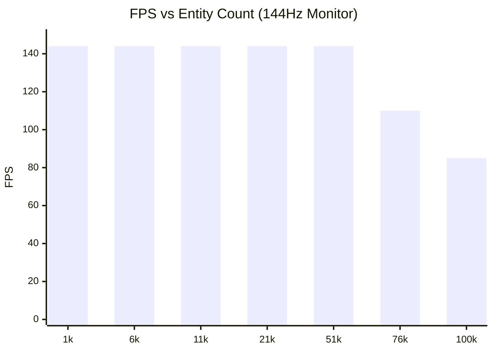

# Performance & Benchmarks

PlutoEngine is designed to comfortably render and update tens to hundreds of thousands of entities directly in the browser by leveraging zero-allocation, Structure of Arrays (SoA), and WebGL2 hardware instancing.

## Auto-Scaling Benchmark
We ran a benchmark that simulates massive swarms of enemies chasing a player, using **Continuum Crowds (Poisson Fluid Dynamics)**. The player automatically navigates towards areas with the lowest enemy density.

**[👉 Run Benchmark Demo](/pluto-engine/demos/benchmark/index.html)**

### Results (144FPS Target)
- **Environment**: Desktop PC (Chrome)
- **Conditions**: Computing Poisson solver grid flows + updating and rendering all entity transforms every frame. Measured the maximum entity count before dropping from 144FPS.

> *Note: Results depend heavily on GPU capabilities (e.g., M1/M2 Mac, RTX series). On modern desktop PCs, the engine maintains 144FPS up to **50,000 entities**, and still runs at ~90FPS with 100,000 entities.*

## The Secret to Performance
1. **TypedArray SoA**: Every entity's `x` and `y` are stored in flat `Float32Array`s. There is no object creation or destruction in the hot loop, preventing Garbage Collection (GC) spikes entirely.
2. **GPU Instancing**: The `renderer` package uploads the modified `Float32Array` subarrays directly to WebGL2 buffers and issues a single `drawInstanced` call for all entities.
3. **Grid-Based Fluid Dynamics**: Instead of checking O(N^2) collisions for 100,000 enemies, the engine splats density to a grid and solves the Poisson equation. This naturally simulates swarm behavior and avoidance in O(N) time.
