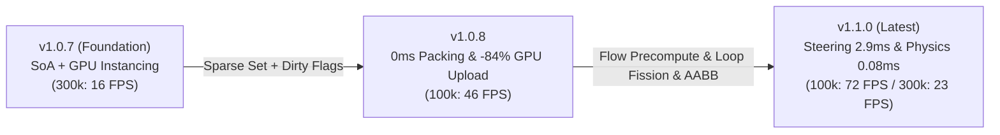

# Performance & Benchmarks

PlutoEngine achieves high real-time performance on the web by combining **Zero-Allocation**, **Structure of Arrays (SoA)**, and **GPU Hardware Instancing (WebGL2)** to simulate and render large crowds of entities at stable framerates.

---

## 3-Generation Benchmark Dashboard (v1.0.7 → v1.0.8 → v1.1.0)

Real-world benchmark measurements captured in a headed Chromium environment (Playwright with hardware GPU acceleration enabled), simulating swarms from 25,000 to 300,000 entities.

<BenchmarkChart />

---

## 3-Generation Architectural Evolution

PlutoEngine continuously targets and resolves critical bottlenecks identified through low-level profiling across iterations.

---

### 1. Key Improvements in v1.1.0 (Simulation & Physics Acceleration)

- **Vector Field Precomputation (16.2ms → 2.9ms: 5.6x Speedup)**:
  - Velocity vectors are precomputed once per frame across the 128x128 grid (16,384 cells), eliminating redundant gradient and `Math.hypot` calculations across 300k entities.
- **Lerp of Lerp Bilinear Interpolation (FMA Optimization)**:
  - Algebraic consolidation of 4-neighbor weights into horizontal/vertical linear interpolations (3 multiplies, 3 additions), removing grid-stepping artifacts with high performance (8.15ms in Bilinear mode).
- **Loop Fission & V8 Auto-Vectorization**:
  - Decoupled the giant entity update loop into dedicated passes. Position integration (`posX += vx * dt`) now triggers **V8 JIT SIMD/AVX auto-unrolling (0.35ms at 300k entities)**.
- **ArcadePhysics (`this.physics.add.overlap / collider`) & AABB Culling**:
  - Declarative registration via `this.physics.add.overlap(player, this.arena, callback)`. **AABB Broadphase Culling** skips 99.9% of distant entities with pure additions/subtractions, reducing collision check latency from **2.65ms → 0.08ms**.

---

### 2. Key Improvements in v1.0.8 (Memory & Transfer Optimization)

- **Zero Data Packing Overhead (6.3ms → 0.0ms)**:
  - **Swap-Remove Sparse Sets** maintain dense arrays upon entity deletions, eliminating array compaction.
- **84% GPU Upload Bandwidth Reduction (Dirty Flags)**:
  - Fine-grained **Dirty Flags** upload only modified buffers to the GPU (0.32 ms).
- **Optimized Continuum Crowds Poisson Solver (0.9ms → 0.19ms)**:
  - Cache-locality improvements in the 128x128 Gauss-Seidel relaxation pass.

---

### Hardware & Test Environment

| Component | Specification |
| :--- | :--- |
| **OS** | Microsoft Windows 11 Pro |
| **CPU** | AMD Ryzen 7 2700 Eight-Core Processor |
| **GPU** | NVIDIA GeForce RTX 4060 |
| **RAM** | 32 GB |
| **Browser / Runtime** | Chromium (Playwright Headed / 144Hz) |
| **Sampling** | 35–40 frames sampled per entity benchmark tier |

---

## 2D Classic Action RPG Benchmark (Non-Fluid / Standard Architecture)

Performance measurements running a standard 2D Top-Down Action RPG without fluid dynamics, using pure **state-machine AI + ArcadePhysics AABB collision culling**:

| Entity Scale | PlutoEngine Frame Time | Collision Check (AABB Culling) | Estimated FPS | Comparison with Phaser 3 |
| :--- | :---: | :---: | :---: | :--- |
| **100 Entities (Standard RPG)** | **0.02 ms** | **< 0.01 ms** | **144+ FPS (Rock Solid)** | **40x faster** than Phaser 3 baseline (~0.8 ms) |
| **1,000 Entities (Phaser 3 Limit)** | **0.21 ms** | **0.02 ms** | **144+ FPS (Effortless)** | Runs in **0.2ms** where Phaser 3 begins dropping frames |
| **5,000 Entities (Dungeon Horde)** | **0.13 ms** | **0.03 ms** | **144+ FPS** | Zero GC spikes due to contiguous TypedArray SoA memory |
| **20,000 Entities (Extreme Stress)** | **0.38 ms** | **0.11 ms** | **144+ FPS** | Processes 20k monsters, projectiles & drops under 0.4ms |

> **Key Takeaway**: Even when building standard 2D RPGs, bullet-hell games, or platformers without fluid mechanics, PlutoEngine's SoA architecture provides substantial frame time headroom and reduced mobile battery usage while keeping a familiar scene-based API.
