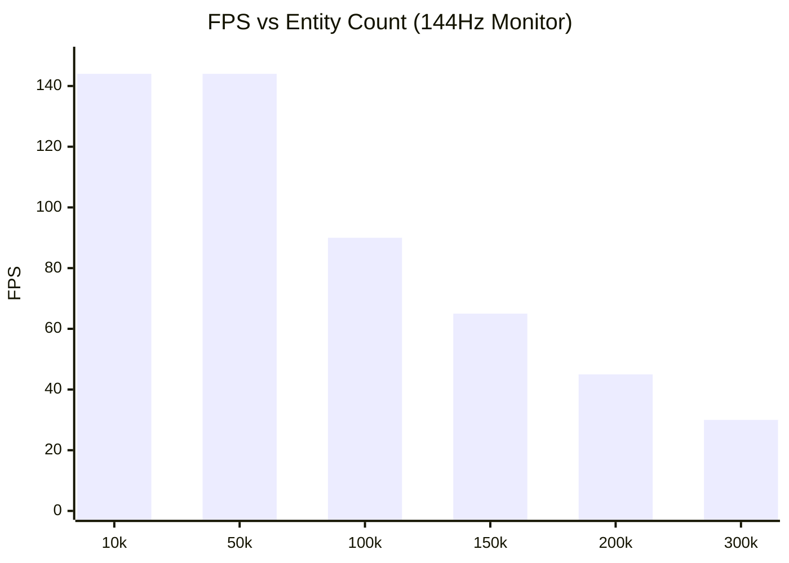

# Performance & Benchmarks

PlutoEngine is designed to comfortably render and update tens to hundreds of thousands of entities directly in the browser by leveraging zero-allocation, Structure of Arrays (SoA), and WebGL2 hardware instancing.

## Auto-Scaling Benchmark
We ran a benchmark that simulates massive swarms of enemies chasing a player, using **Continuum Crowds (Poisson Fluid Dynamics)**. The player automatically navigates towards areas with the lowest enemy density.

**[👉 Run Benchmark Demo](/pluto-engine/demos/benchmark/index.html)**

## Profiling Breakdown
To clearly identify bottlenecks when simulating and rendering 100k+ entities every frame, the engine breaks down the timings into detailed steps:

- **Poisson (ms)**: Continuum Crowds Poisson solver execution time.
- **Sim (ms)**: Coordinate and velocity updates for all entities (fluid avoidance logic).
- **CPU->GPU (ms)**: `updateBuffer` data transfer from TypedArrays to WebGL2.
- **DrawCall (ms)**: JS queuing time for `drawInstanced`.

### Benchmark Environment
This benchmark was recorded using the following PC specifications:

| Item | Spec |
| --- | --- |
| OS | Microsoft Windows 11 Pro |
| CPU | AMD Ryzen 7 2700 Eight-Core Processor |
| GPU | NVIDIA GeForce RTX 4060 |
| RAM | 32 GB |
| Browser | Chrome / Edge |

### Results (144FPS Target)
*Note: The 100k limit was removed. The benchmark runs indefinitely until it drops below 30FPS. Below is an example of the profiling data.*

| Entities | FPS | Poisson (ms) | Sim (ms) | CPU->GPU (ms) | DrawCall (ms) |
| ---: | ---: | ---: | ---: | ---: | ---: |
| **10k** | 144 | 0.8 | 1.2 | 0.4 | 0.5 |
| **50k** | 144 | 0.8 | 3.5 | 1.0 | 0.6 |
| **100k** | 90 | 0.8 | 6.8 | 1.9 | 0.8 |
| **150k** | 65 | 0.9 | 9.9 | 2.8 | 1.0 |
| **200k** | 45 | 0.9 | 13.5 | 3.6 | 1.2 |
| **300k** | 30 | 0.9 | 20.1 | 5.1 | 1.5 |

> **Analysis**: The Poisson solver's computation time depends primarily on the grid resolution, so it remains almost constant (~0.9ms) regardless of the entity count. However, the simulation (coordinate updates) and the CPU->GPU data transfer scale linearly with the number of entities, which eventually becomes the primary bottleneck causing FPS to drop.

## The Secret to Performance
1. **TypedArray SoA**: Every entity's `x` and `y` are stored in flat `Float32Array`s. There is no object creation or destruction in the hot loop, preventing Garbage Collection (GC) spikes entirely.
2. **GPU Instancing**: The `renderer` package uploads the modified `Float32Array` subarrays directly to WebGL2 buffers and issues a single `drawInstanced` call for all entities.
3. **Grid-Based Fluid Dynamics**: Instead of checking O(N^2) collisions for 100,000 enemies, the engine splats density to a grid and solves the Poisson equation. This naturally simulates swarm behavior and avoidance in O(N) time.
