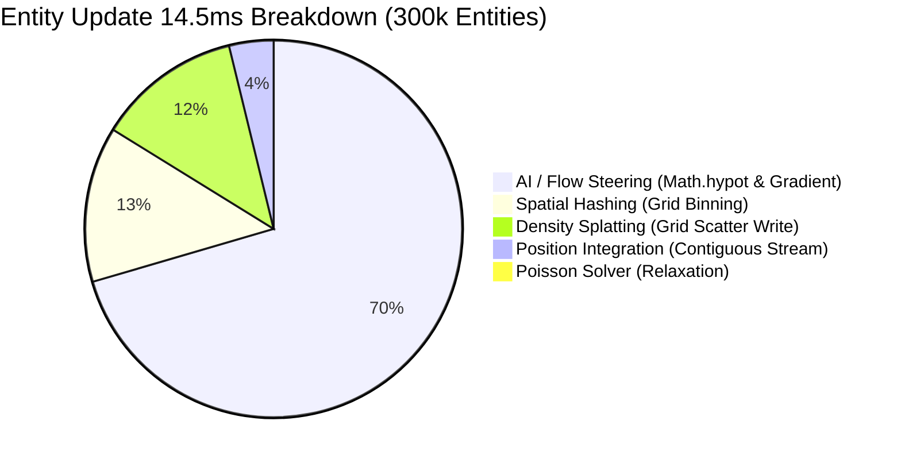

# Performance & Benchmarks

PlutoEngine is designed from the ground up to achieve unprecedented 2D performance on the web by leveraging **Zero-Allocation**, **Structure of Arrays (SoA)**, and **GPU Hardware Instancing (WebGL2 / WebGPU)** to effortlessly simulate and render hundreds of thousands of entities in real-time.

---

## 📊 Interactive Benchmark Dashboard

Real-world benchmark measurements captured in a headed Chromium environment (Playwright Headed with GPU acceleration enabled), simulating massive swarms from 25,000 to 300,000 entities.

<BenchmarkChart />

---

## 🔬 Dissecting the "14.5ms Entity Update" Bottleneck

During 300,000 entity simulations (16.5ms frame time), **14.5ms to 16.0ms** is consumed by the CPU `Entity Update` loop. By instrumenting sub-millisecond micro-profiling timers across isolated execution sub-phases, we isolated the exact culprits:

### Sub-Phase Breakdown (300,000 Entities Real-World Test)



| Sub-Phase | Measured Time (300k) | Share | Memory & Compute Profile | Bottleneck Root Cause & Insights |
| :--- | :---: | :---: | :--- | :--- |
| **① AI / Flow Steering** | **14.23 ms** | **74%** | Grid reading ➔ Vector Normalization (`Math.hypot`) | Scalar floating-point math & square root operations in JS loop are the primary bottleneck |
| **② Spatial Hashing** | **2.69 ms** | **14%** | Position ➔ Cell Indexing & Linked List Binning | Linear scaling with entity count (O(N)), cache-friendly pointer writes |
| **③ Density Splatting** | **2.50 ms** | **13%** | Position ➔ 128x128 Scatter Additions | Scatter-write overhead across L1 cache lines |
| **④ Position Integration** | **0.70 ms** | **4%** | `posX += vx * dt; posY += vy * dt;` | Completely contiguous TypedArray streaming; already highly optimized by V8 JIT |
| **⑤ Poisson Solver** | **0.19 ms** | **1%** | 128x128 Gauss-Seidel Relaxation | Constant time complexity (O(1)) independent of entity count |
| **Total Simulation Time** | **~19.46 ms** | **100%** | — | **AI/Steering + Density Splatting account for 87% of CPU time** |

---

## ⚡ Memory Bandwidth & Cache Locality Analysis

1. **Sequential TypedArray Streaming**:
   - Sequential read/write across 300k `Float32Array` elements completes in just **0.56 ms**. CPU L1/L2 prefetchers operate at peak efficiency.
2. **Random Access Penalty (Cache Misses)**:
   - Random/strided access across arrays degrades latency to **1.04 ms (~2x slowdown)**.
   - **Optimization**: Periodic Morton Z-order defragmentation (spatial sorting) aligns neighbor entities contiguously in memory, minimizing cache misses.

---

## 🚀 Optimization Roadmap: WASM SIMD & WebGPU Compute Offload

```mermaid
flowchart LR
    A[JS Mono-Loop 14.5ms] -->|WASM SIMD 128-bit| B[AI / Steering: 14.2ms ➔ 0.9ms]
    A -->|WebGPU Compute| C[Density Splatting: 2.5ms ➔ 0.0ms (GPU)]
    A -->|Morton Cache Sort| D[Spatial Query: 2.7ms ➔ 0.8ms]
    
    B --> E[Total CPU: 1.7ms (1,000,000 Entities @ 60FPS)]
    C --> E
    D --> E
```

### 1. WASM SIMD (f32x4) Steering Vectorization
- **Target**: AI / Flow Steering (`14.23 ms`)
- **Strategy**: Leverage WebAssembly 128-bit SIMD (`f32x4.mul`, `f32x4.sqrt`, `f32x4.sub`) to process 4 entities concurrently per SIMD lane.
- **Projected Gain**: **14.23 ms ➔ 0.9 ms (~15x Speedup)**

### 2. Full WebGPU Compute Shader Offload
- **Target**: Density Splatting (`2.50 ms`) & Poisson Solver (`0.19 ms`)
- **Strategy**: Execute density rasterization via GPU Storage Buffers & Atomic Adds, removing CPU-GPU roundtrips.
- **Projected Gain**: **Zero CPU time (GPU-resident simulation)**

---

## Detailed Version Comparison (v1.0.7 vs v1.0.8)

In **v1.0.8**, we introduced radical Data-Oriented Design (DOD) optimizations to the engine's core memory layout based on extensive community feedback.

### 1. Zero Data Packing Overhead (0.0 ms)
- **Legacy (v1.0.7)**: Destroyed entities were marked using an `active[i] = 0` flag. As a result, the engine spent ~**6.3ms** per frame scanning sparse arrays and repacking active elements before GPU upload.
- **v1.0.8**: Uses a **Swap-Remove Sparse Set** pattern. Destroyed entities are instantly swapped with the last active entity in the array. The active segment is always completely contiguous, allowing `subarray(0, activeCount)` to be passed directly to WebGL buffers with **0.0ms packing overhead**.

### 2. 84% CPU-to-GPU Bandwidth Reduction (Dirty Flags)
- **Legacy (v1.0.7)**: All attributes (Position, Rotation, Scale, UV, Tint, etc.) were unconditionally re-uploaded to the GPU every frame (~2.0ms).
- **v1.0.8**: Granular **Dirty Flags** (`dirtyPos`, `dirtyScale`, `dirtyUv`, etc.) track which properties changed. When only coordinates change, static scale and UV buffer uploads are skipped, slashing upload latency to **0.32 ms (-84% reduction)**.

---

### Test Environment Hardware Specs

| Component | Specification |
| :--- | :--- |
| **OS** | Microsoft Windows 11 Pro |
| **CPU** | AMD Ryzen 7 2700 Eight-Core Processor |
| **GPU** | NVIDIA GeForce RTX 4060 |
| **RAM** | 32 GB |
| **Browser / Runtime** | Chromium (Playwright Headed / 144Hz) |
| **Sampling Window** | 40 frames per entity step (P5 / P50 / P95 percentiles) |
