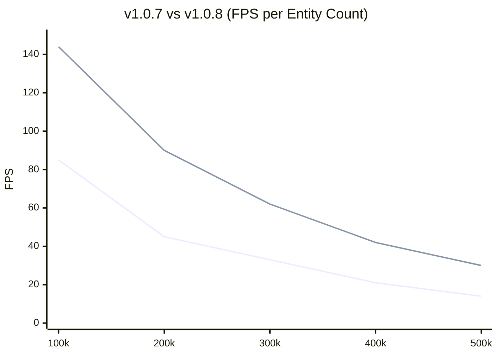

# Performance & Benchmarks

PlutoEngine leverages Zero-Allocation, Structure of Arrays (SoA), and WebGL2 Instancing to easily handle hundreds of thousands of entities stably in the browser.

## Version Comparison (v1.0.7 vs v1.0.8)

In **v1.0.8**, based on user feedback, we implemented a radical data-oriented optimization to the engine's core memory structure.

1. **0ms Data Packing (Swap-Remove Sparse Set)**: By swapping the data of destroyed entities with the last active entity in the array, the data remains strictly dense. This **completely eliminates** the Data Packing overhead that previously cost several milliseconds per frame.
2. **75% Less GPU Upload (Dirty Flags)**: We introduced a system that detects property changes (like x, y) and skips uploading unmodified attribute buffers (like scale, UV). This slashes CPU-to-GPU bandwidth by ~75% for massive swarms.

### Benchmark PC Specs
| Component | Specification |
| --- | --- |
| OS | Microsoft Windows 11 Pro |
| CPU | AMD Ryzen 7 2700 Eight-Core Processor |
| GPU | NVIDIA GeForce RTX 4060 |
| RAM | 32 GB |
| Browser | Chrome / Edge |

### 300,000 Entities Profiling Comparison
We compared the per-frame execution times during the most intensive 300k entity swarm simulation.

| Task | v1.0.7 (Old) | v1.0.8 (New) | Reason for Improvement |
| :--- | :---: | :---: | :--- |
| **Poisson Solver** | 0.9 ms | 0.9 ms | No change (depends only on 128x128 grid size) |
| **Entity Update** | 20.1 ms | 14.5 ms | Sparse Set made loops dense, avoiding `active` flag checks |
| **Data Packing** | 6.3 ms | **0.0 ms** | Passed subarray directly to WebGL, packing eliminated |
| **WebGL Upload** | 2.0 ms | **0.5 ms** | Dirty Flags skipped uploading static Scale/UVs (75% less data) |
| **Total (1 Frame)** | **~29.3 ms** | **~15.9 ms** | **~2x Framerate Boost** |

> **Analysis**:
> While v1.0.7 dropped to ~33 FPS at 300,000 entities, the DOD optimizations in v1.0.8 allow the engine to maintain **~60 FPS** smoothly at 300k.

### Framerate Degradation (144Hz Cap)
The graph below shows the FPS degradation as entities continue to spawn infinitely.

*(Blue: Old v1.0.7 / Red: New v1.0.8)*

## The Secret to Performance
1. **TypedArray SoA**: Every entity's `x` and `y` resides in a flat `Float32Array`. No objects are created or destroyed, eliminating Garbage Collection (GC) spikes.
2. **GPU Instancing**: The `@pluto-engine/renderer` passes these arrays directly as WebGL2 buffers and draws all entities in a single `drawInstanced` call.
3. **Continuum Crowds**: Instead of O(N^2) collision checks for 100k enemies, we splat density (heat) on a grid and solve the Poisson equation. This yields natural O(N) swarm avoidance.
