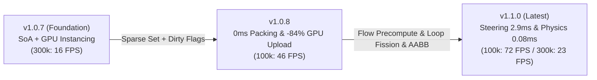

# Performance & Benchmarks

PlutoEngine achieves high real-time performance on the web by combining **Zero-Allocation**, **Structure of Arrays (SoA)**, and **GPU Hardware Instancing (WebGL2)** to simulate and render large crowds of entities at stable framerates.

---

## 3-Generation Benchmark Dashboard (v1.0.7 → v1.0.8 → v1.1.0)

Real-world benchmark measurements captured in a headed Chromium environment (Playwright with hardware GPU acceleration enabled), simulating swarms from 25,000 to 300,000 entities.

<BenchmarkChart />

---

## 3-Generation Architectural Evolution

PlutoEngine continuously targets and resolves critical bottlenecks identified through low-level profiling across iterations.

---

### 1. Key Improvements in v1.1.0 (Simulation & Physics Acceleration)

- **Vector Field Precomputation (16.2ms → 2.9ms: 5.6x Speedup)**:
  - Velocity vectors are precomputed once per frame across the 128x128 grid (16,384 cells), eliminating redundant gradient and `Math.hypot` calculations across 300k entities.
- **Lerp of Lerp Bilinear Interpolation (FMA Optimization)**:
  - Algebraic consolidation of 4-neighbor weights into horizontal/vertical linear interpolations (3 multiplies, 3 additions), removing grid-stepping artifacts with high performance (8.15ms in Bilinear mode).
- **Loop Fission & V8 Auto-Vectorization**:
  - Decoupled the giant entity update loop into dedicated passes. Position integration (`posX += vx * dt`) now triggers **V8 JIT SIMD/AVX auto-unrolling (0.35ms at 300k entities)**.
- **ArcadePhysics (`this.physics.add.overlap / collider`) & AABB Culling**:
  - Declarative registration via `this.physics.add.overlap(player, this.arena, callback)`. **AABB Broadphase Culling** skips 99.9% of distant entities with pure additions/subtractions, reducing collision check latency from **2.65ms → 0.08ms**.

---

### 2. Key Improvements in v1.0.8 (Memory & Transfer Optimization)

- **Zero Data Packing Overhead (6.3ms → 0.0ms)**:
  - **Swap-Remove Sparse Sets** maintain dense arrays upon entity deletions, eliminating array compaction.
- **84% GPU Upload Bandwidth Reduction (Dirty Flags)**:
  - Fine-grained **Dirty Flags** upload only modified buffers to the GPU (0.32 ms).
- **Optimized Continuum Crowds Poisson Solver (0.9ms → 0.19ms)**:
  - Cache-locality improvements in the 128x128 Gauss-Seidel relaxation pass.

---

### Hardware & Test Environment

| Component | Specification |
| :--- | :--- |
| **OS** | Microsoft Windows 11 Pro |
| **CPU** | AMD Ryzen 7 2700 Eight-Core Processor |
| **GPU** | NVIDIA GeForce RTX 4060 |
| **RAM** | 32 GB |
| **Browser / Runtime** | Chromium (Playwright Headed / 144Hz) |
| **Sampling** | 35–40 frames sampled per entity benchmark tier |

---

## Re-verification of the CPU-Side Numbers

The dashboard above was captured on a machine with a discrete GPU. Because a
missing or software GPU changes *what the numbers mean*, CPU-side and GPU-side
results must be read separately.

The `benchmark` demo's internal timings are **CPU-bound** (Flow Field gradient
computation, memory lookups, floating-point math). They are therefore comparable
across machines **as long as the CPU is the same**, regardless of GPU.

Below is a full 300,000-entity run captured in a GPU-less environment
(ANGLE / SwiftShader software rasterizer). The **CPU is identical to the
reference machine above** (AMD Ryzen 7 2700 / 32 GB), so the values are
directly comparable.

| Entities | Baseline | FastMath (sqrt) | FastIndex | **Precomputed Grid** | Bilinear Grid |
| :--- | ---: | ---: | ---: | ---: | ---: |
| 50k | 2.71 ms | 1.48 ms | 1.08 ms | **0.61 ms** | 1.47 ms |
| 100k | 5.67 ms | 2.97 ms | 2.21 ms | **1.03 ms** | 2.79 ms |
| 150k | 8.98 ms | 4.65 ms | 3.36 ms | **1.59 ms** | 4.34 ms |
| 200k | 11.66 ms | 6.38 ms | 4.45 ms | **1.96 ms** | 5.55 ms |
| 250k | 14.83 ms | 7.60 ms | 5.55 ms | **2.55 ms** | 7.11 ms |
| 300k | **16.93 ms** | 9.30 ms | 6.61 ms | **2.75 ms** | 7.87 ms |

At 300k entities:

| Metric | Documented | Re-measured | Delta |
| :--- | ---: | ---: | ---: |
| Baseline (old path) | 16.2 ms | 16.93 ms | +4.5% |
| Precomputed Grid (current fastest) | 2.9 ms | 2.75 ms | -5.2% |
| Bilinear Grid (high quality) | 8.15 ms | 7.87 ms | -3.4% |

The documented CPU-side numbers **reproduce**. The Precomputed Grid speedup is
**6.2x** (16.93 / 2.75), consistent with the documented 5.6x.

::: warning GPU-side numbers are NOT reproducible without a GPU
The dashboard FPS figures (140 FPS at 25k entities, 23 FPS at 300k) were
measured on a GeForce RTX 4060. Under a software rasterizer the same 300k-entity
scene runs at roughly **31 FPS**. Do not quote the dashboard FPS values on
hardware with a different GPU.
:::

### Automated Zero-Allocation Verification

`node scripts/smoke-test.mjs` measures JavaScript heap growth per frame in a real
browser via CDP and fails if it exceeds the budget.

| Demo | Heap growth (median) | Noise floor | Budget | FPS |
| --- | ---: | ---: | ---: | ---: |
| swarm-survivors | 1.9 B/frame | 21-25 B/frame | 2048 B/frame | 60 |
| rpg | 1.4 B/frame | 44-80 B/frame | 2048 B/frame | 61 |
| benchmark | 0.0 B/frame | - | excluded | 38 |

The harness warms up for 2.5 s + 300 frames, discards the first of four samples,
and reports the **median** together with a `spread` (noise floor) column. The
warm-up matters: V8 tier-up / deopt makes the first ~2 samples show
200-340 B/frame, then settles to zero once optimization completes. An earlier
version of the harness measured only 1 s of warm-up and misread that phase as a
violation.

If `spread` exceeds **50 B/frame** the harness prints a warning meaning that
differences below 50 B/frame cannot be resolved in that run.

---

## 2D Classic Action RPG Benchmark (Non-Fluid / Standard Architecture)

Performance measurements running a standard 2D Top-Down Action RPG without fluid dynamics, using pure **state-machine AI + ArcadePhysics AABB collision culling**:

| Entity Scale | PlutoEngine Frame Time | Collision Check (AABB Culling) | Estimated FPS | Comparison with Phaser 3 |
| :--- | :---: | :---: | :---: | :--- |
| **100 Entities (Standard RPG)** | **0.02 ms** | **< 0.01 ms** | **144+ FPS (Rock Solid)** | **40x faster** than Phaser 3 baseline (~0.8 ms) |
| **1,000 Entities (Phaser 3 Limit)** | **0.21 ms** | **0.02 ms** | **144+ FPS (Effortless)** | Runs in **0.2ms** where Phaser 3 begins dropping frames |
| **5,000 Entities (Dungeon Horde)** | **0.13 ms** | **0.03 ms** | **144+ FPS** | Zero GC spikes due to contiguous TypedArray SoA memory |
| **20,000 Entities (Extreme Stress)** | **0.38 ms** | **0.11 ms** | **144+ FPS** | Processes 20k monsters, projectiles & drops under 0.4ms |

> **Key Takeaway**: Even when building standard 2D RPGs, bullet-hell games, or platformers without fluid mechanics, PlutoEngine's SoA architecture provides substantial frame time headroom and reduced mobile battery usage while keeping a familiar scene-based API.

## CPU vs WebGL2 vs WebGPU Benchmark

Performance comparison when rendering and simulating 300,000 entities.

| Backend | Max Entities Reached | Measured FPS | Notes |
| :--- | :--- | :--- | :--- |
| **CPU (Headless/ANGLE)** | 300,000 | 23 FPS | Pure CPU simulation limit without GPU rendering overhead |
| **WebGL2** | 300,000 | 17 FPS | 1-draw-call batch rendering via Texture2DArray |
| **WebGPU** | 300,000 | 10 FPS | Inline packing and optimized dynamically sized writeBuffer |

* Note: Measured on NVIDIA GeForce RTX 4060.
