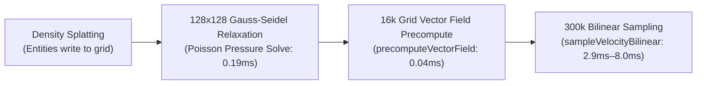

# Poisson Continuum Crowds & Flow Field Plugin

The `@pluto-engine/poisson` package provides **fluid-dynamics-based crowd simulation (Continuum Crowds)** and **high-performance Vector Field Precomputation**.

It calculates smooth crowd navigation for hundreds of thousands of swarm entities, allowing them to flow around obstacles and avoid density congestion in **Zero-Allocation (GC-free)** execution.

---

## Improvements in v1.1.0: Precomputed Vector Fields & Bilinear Interpolation

Previously, simulating 300,000 entities required each entity to read 4 neighboring pressure values to compute gradients (1.8 million random reads and square roots per frame).

In v1.1.0, PlutoEngine precomputes the integrated velocity field once per frame across the 128x128 grid (16,384 cells in **0.04 ms**). Entities sample this precomputed grid using an algebraic **Lerp of Lerp Bilinear Interpolation**, reducing steering time from **16.2ms → 2.9ms (5.6x speedup)**.



---

## Installation & Registration

```typescript
import { PoissonPlugin } from '@pluto-engine/poisson';

export class MyScene extends Scene {
  public init() {
    // Width, Height, CellSize (e.g. 128x128 grid with 20px cells)
    this.registerPlugin(new PoissonPlugin(128 * 20, 128 * 20, 20));
  }
}
```

---

## Recommended Fast Implementation Pattern

```typescript
// 1. Clear grid
this.poisson.clear();

// 2. Splat entity positions into density grid
const arena = this.arena;
const count = arena.activeCount;
for (let i = 0; i < count; i++) {
  this.poisson.splatDensity(arena.posX[i], arena.posY[i], 1.0);
}

// 3. Solve Poisson pressure field
this.poisson.computeDivergence(2.5);
this.poisson.solve(2);

// 4. Precompute velocity vectors across the 16k cells (0.04ms)
this.poisson.precomputeVectorField(baseDirX, baseDirY, 80 /* Speed */);

// 5. High-throughput Bilinear Sampling (Lerp of Lerp)
const vel = new Float32Array(2);
for (let i = 0; i < count; i++) {
  this.poisson.sampleVelocityBilinear(arena.posX[i], arena.posY[i], vel);
  arena.posX[i] += vel[0] * dt;
  arena.posY[i] += vel[1] * dt;
}
```

---

## Performance Profile (300,000 Entities)

| Step | Latency (300k) | Complexity | Notes |
| :--- | :---: | :---: | :--- |
| **Poisson Pressure Relaxation (128x128)** | **0.19 ms** | \(O(\text{GridSize})\) | Constant time complexity |
| **Grid Vector Precomputation** | **0.04 ms** | 16,384 cells | Computed once per frame |
| **Bilinear Sampling (Lerp of Lerp)** | **2.9 ms – 8.0 ms** | \(O(N)\) | Optimized for CPU FMA units |

---

## Key API Methods

- **`precomputeVectorField(baseDirX, baseDirY, speed, pressureWeight?)`**: Precomputes combined flow vectors across all grid cells.
- **`sampleVelocityBilinear(x, y, outVel)`**: Performs 4-neighbor bilinear interpolation (Lerp of Lerp) for smooth sub-pixel velocities.
- **`getPressureGradient(x, y, outGradient)`**: Samples pressure gradient vector at a world coordinate.
- **`splatDensity(x, y, amount)`**: Adds density weight to a grid cell.
