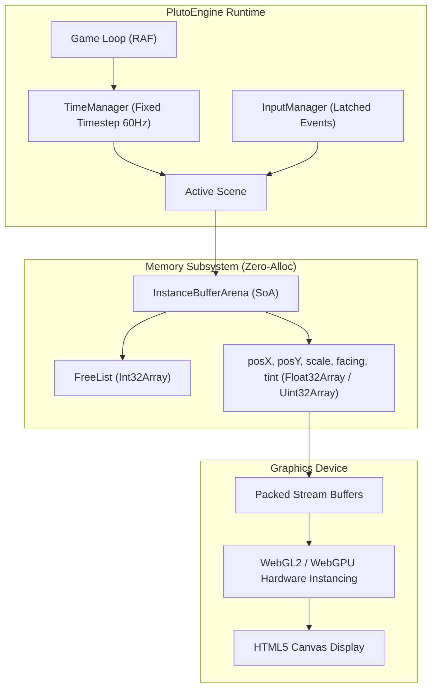

# アーキテクチャ概要

PlutoEngine の圧倒的なパフォーマンスは、偶然の産物ではありません。CPUキャッシュ構造、JavaScriptエンジンの内部動作（V8 JIT / GC）、そしてGPUハードウェアの特性を徹底的に計算した**データ指向アーキテクチャ（Data-Oriented Architecture）**に基づいています。



---

## 1. InstanceBufferArena: SoA メモリアリーナ

従来のオブジェクト指向（Array of Structures: AoS）では、エンティティごとに独立したオブジェクトがヒープ領域に割り当てられます：

```typescript
// ❌ 従来の AoS (Array of Structures)
// メモリ上にオブジェクトが断片化し、GCの対象になる
interface Entity {
  x: number;      // 8 bytes
  y: number;      // 8 bytes
  scale: number;  // 8 bytes
  facing: number; // 8 bytes
  tint: number;   // 8 bytes
}
const entities: Entity[] = []; // ポインタ配列によるキャッシュミス
```

PlutoEngine では、すべてのデータがフラットな型付き配列（Structure of Arrays: SoA）として事前確保されます：

```typescript
//  PlutoEngine の SoA (Structure of Arrays)
export class InstanceBufferArena {
  public readonly capacity: number;
  public readonly posX: Float32Array;
  public readonly posY: Float32Array;
  public readonly scale: Float32Array;
  public readonly facing: Float32Array;
  public readonly tint: Uint32Array;
  public readonly active: Uint8Array;
  // ...
}
```

### なぜ SoA なのか？
1. **CPUキャッシュラインの最大活用**: 現代のCPUは、メモリからデータを読み込む際に 64 バイト単位（キャッシュライン）で一括フェッチします。全エンティティの X 座標を走査するとき、連続した `Float32Array` であれば、1 回のフェッチで 16 個分の座標（4 bytes × 16 = 64 bytes）がキャッシュに載り、メモリアクセスの待機時間がゼロになります。
2. **SIMD / JIT最適化**: 配列内の連続アクセスは、ブラウザのJITコンパイラによって自動ベクトル化（SIMD命令）されやすくなります。

---

## 2. フリーリストによる $O(1)$ メモリ管理

エンティティの生成（`allocate`）と破棄（`free`）において、JavaScriptのヒープ割り当ては一切発生しません。`Int32Array` で実装されたスタック形式の**フリーリスト（Free List）**によって、すべて $O(1)$ の極小コストで処理されます。

```typescript
// フリーリストの動作原理
public allocate(): number {
  if (this.freeListHead >= this.capacity) return -1; // 枯渇時は -1
  const id = this.freeList[this.freeListHead++];
  this.active[id] = 1;
  // デフォルト値の初期化
  this.posX[id] = 0;
  this.posY[id] = 0;
  return id;
}

public free(id: number): void {
  this.active[id] = 0;
  this.freeList[--this.freeListHead] = id; // 即座に再利用スロットへ返却
}
```

敵が倒れたときに `free(id)` を呼ぶと、ID番号がフリーリストの先頭に戻ります。次のフレームで新しい敵が出現した際には、その空きスロットが即座に再利用されます。

---

## 3. フライウェイト・ハンドル (Flyweight Pattern)

開発者が純粋な配列操作（`arena.posX[id]`）ばかりを書く必要がないよう、直感的な `Sprite` ハンドルが用意されています。

```typescript
export class Sprite {
  public readonly id: number;
  private readonly _arena: InstanceBufferArena;

  constructor(id: number, arena: InstanceBufferArena) {
    this.id = id;
    this._arena = arena;
  }

  public get x(): number { return this._arena.posX[this.id]; }
  public set x(val: number) { this._arena.posX[this.id] = val; }

  public destroy(): void {
    this._arena.free(this.id);
  }
}
```

`Sprite` はヒープ上の巨大なプロトタイプチェーンを持たず、実質的に「ただの整数ID」と「アリーナ参照」だけを保持します。

---

## 4. 固定タイムステップと可変フレームレート

ゲームループは、物理挙動の安定性と描画の滑らかさを両立するため、**アキュムレータ方式の固定タイムステップ（Fixed Timestep with Accumulator）**を採用しています。

```
[ RequestAnimationFrame (可変 dt: 144Hz, 60Hz, etc.) ]
                  │
                  ▼
         TimeManager.step(now)
                  │
      ┌───────────┴───────────┐
      ▼                       ▼
  accumulator += dt     accumulator < fixedDt (1/60s)?
      │                       │
      │ (残余分を消費)           ▼
      └───> while(accumulator >= fixedDt)
                scene.fixedUpdate(1/60)
                  │
                  ▼
             scene.update(dt)
                  │
                  ▼
             scene.render()
```

- **`fixedUpdate(1/60)`**: 物理シミュレーション（XPBD）、衝突判定、AI意思決定など、決定論的（Deterministic）な精度が求められる処理を行います。
- **`update(dt)`**: カメラの追従、Tweenの補間、入力処理など、ディスプレイのリフレッシュレート（144Hzなど）に同期させたい処理を行います。

---

## 5. ハードウェア・インスタンシング描画パイプライン

10万体のスプライトを描画する際、スプライトごとに描画コマンドを発行するとGPUドライバが過負荷で停止します。
PlutoEngine では、**単一のクアッドメッシュ（4頂点）**に対し、アリーナの座標・スケール配列を頂点アトリビュートとしてバインドし、`drawArraysInstanced` または WebGPU の `drawIndexed(6, count)` を1回だけ呼び出します。

```typescript
// 1回のAPIコールで10万個のインスタンスを瞬時に描画
device.setupInstancedAttributes(gpuBuffers);
device.drawInstanced(renderCount);
```

CPU側でのパッキング処理も、有効なスプライト（`active[i] === 1`）のみを連続バッファへコピーするゼロアロケーション走査で行われます。

---

## 6. ゼロアロケーションを維持するための鉄則

PlutoEngine で最高のパフォーマンスを引き出すための開発ルールです：

1. **ループ内での `new` 禁止**: `new Vector2()` や `new Sprite()` などのインスタンス生成は初期化時に行い、ゲームループ内では行わない。
2. **オブジェクト・配列リテラルの禁止**: `{ x, y }` や `[a, b]` を引数や戻り値に使わず、スカラー値（数値）をそのまま渡す。
3. **クロージャの禁止**: 毎フレーム `arr.forEach((item) => ...)` や `setTimeout` を生成しない。シンプルな `for` ループを使用する。
4. **イベントリスナーの登録解除**: シーンのシャットダウン時にはリソースやリスナーを適切に解放する。
