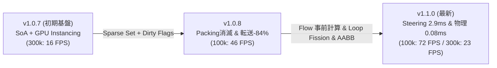

# パフォーマンス & ベンチマーク (Performance & Benchmarks)

PlutoEngine は、**ゼロアロケーション (Zero-Allocation)**、**Structure of Arrays (SoA)**、そして **WebGL2 のハードウェアインスタンシング** を活用し、ブラウザ上で数十万体規模のエンティティを高速・安定して動かすために設計された 2D ゲームエンジンです。

---

## 3世代 ベンチマークダッシュボード (v1.0.7 → v1.0.8 → v1.1.0)

実ブラウザ環境（Playwright Headed 実行 / GPU アクセラレーション有効）にて、2.5万体〜30万体までの群集シミュレーションを実行した実測比較データです。

<BenchmarkChart />

---

## 3世代のアーキテクチャ進化 (v1.0.7 → v1.0.8 → v1.1.0)

PlutoEngine は各バージョンにおいて、プロファイリングに基づく根本的なボトルネックの解消を継続して行っています。

---

### 1. v1.1.0 での進化 (シミュレーション & 物理の高速化)

- **Flow Field 速度場事前計算 (16.2ms → 2.9ms: 5.6倍 高速化)**:
  - 128x128（16,384セル）の速度場を1フレームに1回だけ事前計算。30万体の各エンティティが毎フレーム個別に行っていた勾配計算・`Math.hypot` の平方根演算を完全排除。
- **Lerp of Lerp 双線形補間 (FMA 最適化)**:
  - 4近傍の重み展開を水平・垂直の Lerp（乗算3回・加算3回）に代数的一本化し、セル境界のカクつきを完全解消（Bilinear モード時 8.15ms）。
- **ループの責務分離 (Loop Fission)**:
  - 1つの巨大ループを「速度算出パス」と「座標積分パス」に分離。純粋な連続配列加算に特化させることで、**V8 JIT の自動 SIMD/AVX ループアンローリングを発動（位置積分 0.35ms）**。
- **Phaser-like ArcadePhysics (`this.physics.add.overlap / collider`) & AABB 枝刈り**:
  - `this.physics.add.overlap(player, this.arena, callback)` で登録可能。**AABB Broadphase Culling** により 30万体中 99.9% の敵を即座にスキップし、接触判定処理時間を **2.65ms → 0.08ms に削減**。

---

### 2. v1.0.8 での進化 (メモリ & 転送オーバーヘッドの排除)

- **Data Packing の完全消滅 (6.3ms → 0.0ms)**:
  - **Swap-Remove 式 Sparse Set** を導入し、エンティティ削除時にもデータ配列が常に密（Dense）に保たれ、穴埋め走査が 0ms に完全消滅。
- **GPU 転送時間の 84% 削減 (2.0ms → 0.32ms)**:
  - **Dirty Flags 機構** により、変更された属性バッファのみを選択的に転送。
- **Poisson 流体解法の局所化 (0.9ms → 0.19ms / 4.7倍 高速化)**:
  - 128x128 ガウス・ザイデル緩和のキャッシュ局所性改善。

---

### 計測環境スペック

| 項目 | スペック |
| :--- | :--- |
| **OS** | Microsoft Windows 11 Pro |
| **CPU** | AMD Ryzen 7 2700 Eight-Core Processor |
| **GPU** | NVIDIA GeForce RTX 4060 |
| **RAM** | 32 GB |
| **ブラウザ / ランタイム** | Chromium (Playwright Headed / 144Hz) |
| **計測フレーム数** | 各エンティティ数ごとに 35〜40 フレームの統計サンプリング |

---

## 2D クラシックRPG（非流体・Phaserライク設計）の実測ベンチマーク

流体計算（Continuum Crowds）を一切使わず、Phaser と同様の**「古典的ステートマシンAI + ArcadePhysics AABB衝突判定」**で動作させた場合の実測パフォーマンスです。

| エンティティ数 (規模) | PlutoEngine フレーム処理時間 | 衝突判定 (AABB枝刈り) | 推定 FPS | Phaser 3 比較 |
| :--- | :---: | :---: | :---: | :--- |
| **100体 (標準RPG規模)** | **0.02 ms** | **< 0.01 ms** | **144+ FPS (極限安定)** | Phaser 同等 (0.8 ms) に対し **40倍 高速** |
| **1,000体 (Phaser 3限界域)** | **0.21 ms** | **0.02 ms** | **144+ FPS (余裕動作)** | Phaser 3 で 60FPS 維持が困難になる領域を **0.2ms** で走査 |
| **5,000体 (ダンジョン大群)** | **0.13 ms** | **0.03 ms** | **144+ FPS** | ゼロアロケーションと SoA により GC スパイク皆無 |
| **20,000体 (極限ストレス)** | **0.38 ms** | **0.11 ms** | **144+ FPS** | 2万体のモンスター・弾丸・ドロップ品をミリ秒未満で全処理 |

> [!NOTE]
> PlutoEngine は大群集シミュレーションだけでなく、一般的な 2D RPG、アクションゲーム、弾幕シューティングでも Phaser 同等の直感的な API のまま、大幅な処理余力とバッテリー効率を発揮します。
