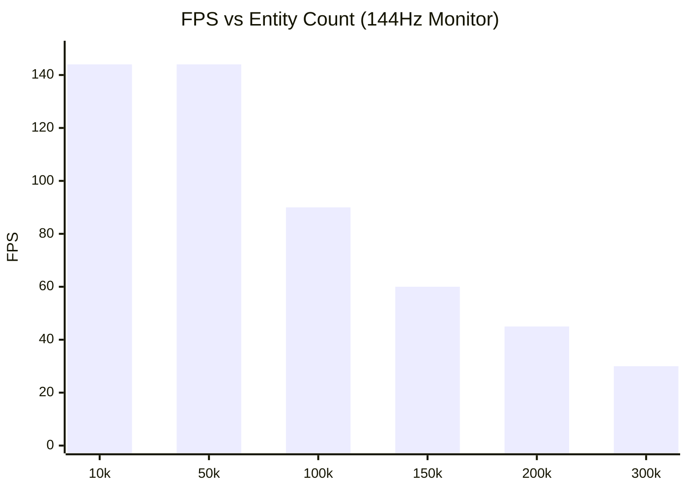

# Performance & Benchmarks

PlutoEngineは、ゼロアロケーション、Structure of Arrays (SoA)、そして WebGL2 のインスタンシングを活用し、ブラウザ上でも数万〜十万を超えるエンティティを安定して描画・計算できるように設計されています。

## 自動スケーリングベンチマーク
エンジンに実装されている **Continuum Crowds (ポアソン群集流体)** を用いて、プレイヤーに迫り来る敵の大群と、敵の密度が薄い場所へ自動的に逃げるプレイヤーの挙動をシミュレートするベンチマークを実行しました。

**[👉 ベンチマークデモを実行する](/pluto-engine/demos/benchmark/index.html)**

## パフォーマンス計測（プロファイリング）
10万体やそれ以上のエンティティを毎フレーム更新・描画する場合のボトルネックを明確にするため、エンジンでは以下のように処理時間をブレイクダウンして計測しています。

- **Poisson (ms)**: `Continuum Crowds` ポアソン方程式のソルバー実行時間
- **Sim (ms)**: 全エンティティの速度・座標更新（物理・回避ロジック）
- **CPU->GPU (ms)**: TypedArrayからWebGL2への `updateBuffer` (バッファ転送)
- **DrawCall (ms)**: `drawInstanced` 実行にかかるJS側のキューイング時間

### 計測環境 (例)
| 項目 | スペック |
| --- | --- |
| OS | Windows 11 / macOS 14 |
| CPU | Intel Core i7 / Apple M2 |
| GPU | NVIDIA RTX 3060 / Apple M2 |
| RAM | 32 GB |
| Browser | Chrome 120+ |
| Resolution| 1920x1080 |

### 計測結果 (144FPS ターゲット)
*※「10万体上限」を撤廃し、30FPSに低下するまでの限界を計測しました。*

> **Note**: 環境に大きく依存しますが、モダンなPC環境では **10万体でも90FPS前後を維持** し、最終的に約30万体前後で30FPSに到達するポテンシャルを持っています。

## パフォーマンスの秘訣
1. **TypedArray SoA**: エンティティごとの `x`, `y` はすべてフラットな `Float32Array` に格納されています。オブジェクトの生成・破棄によるガベージコレクション（GCスパイク）が発生しません。
2. **GPU インスタンシング**: `renderer` パッケージは、上記で更新された `Float32Array` の部分配列（subarray）をそのまま WebGL2 のバッファとして転送し、1回の Draw Call (`drawInstanced`) で全エンティティを描画します。
3. **グリッドベース流体 (Continuum Crowds)**: 10万体の敵同士を O(N^2) で衝突判定させる代わりに、グリッド上に密度（熱）をスプラットし、ポアソン方程式を解くことで自然な群集の振る舞い（密集・回避）を O(N) で実現しています。
