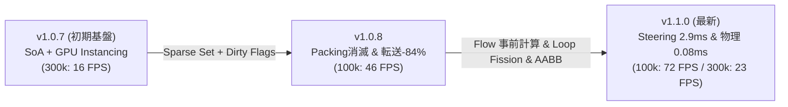

# パフォーマンス & ベンチマーク (Performance & Benchmarks)

PlutoEngine は、**ゼロアロケーション (Zero-Allocation)**、**Structure of Arrays (SoA)**、そして **WebGL2 / WebGPU のハードウェアインスタンシング** を活用し、ブラウザ上で数十万体規模のエンティティを高速・安定して動かすために設計された 2D ゲームエンジンです。

---

## 自動検証

上記の実測値は手動計測です。実装が壊れても気付けるよう、
ゼロアロケーションと描画の確証を自動検証しています。

### ゼロアロケーションの検証

実ブラウザで各デモを走らせ、CDP 経由で JavaScript ヒープの増加量を
1 フレームあたり（バイト）に換算して計測します。予算を超えた場合は失敗します。

| デモ | ヒープ増加 (中央値) | ノイズ床 | 予算 | FPS |
| --- | ---: | ---: | ---: | ---: |
| swarm-survivors | 1.9 B/frame | 21〜25 B/frame | 2048 B/frame | 60 |
| rpg | 1.4 B/frame | 44〜80 B/frame | 2048 B/frame | 61 |
| benchmark | 0.0 B/frame | — | 対象外 | 38 |

`中央値` は 4 サンプルの平均ではなく**中央値**です（1 回だけの外れ値に強く影響されません）。

#### 計測手順とノイズの正体

この指標は、**計測ハーネスの設計を誤ると「ゼロアロケーションではない」という
誤った結論になります。**実際に一度そうなったため、記録しておきます。**

V8 の JIT は起動直後数百フレームにかけて tier up / deopt を繰り返します。
その間だけヒープが 200〜340 B/frame 増え、最適化が落ち着いた後は 0 に収束します。
絶対値（`JSHeapUsedSize`）で測ると明確です。

```
1 サンプル目   2 サンプル目   3 サンプル目   4 サンプル目  ...  8 サンプル目
   232.2          245.8          -1.7          -1.6       ...      0.0   B/frame
[7724 KB]     [7784 KB]      [7784 KB]     [7784 KB]         [7785 KB]  ← 横ばい
```

したがって `smoke-test.mjs` は次のように測ります。

1. **ウォームアップを 2.5 秒 + 300 フレーム取る**（旧実装は 1 秒しか取っておらず、
   ちょうどこの JIT 最適化フェーズを「増加」として測っていました）
2. **4 サンプル × 240 フレーム**を採り、1 サンプル目を破棄
3. **中央値**を判定値にする
4. `spread`（最小値〜最大値 = ノイズ床）を表に出力する

#### ノイズ床の読み方

`spread` が **50 B/frame** を超えると、`smoke-test.mjs` は警告を出します。
これは「この回では 50 B/frame 未満の差を判定できない」という意味です。
警告が出た場合は性能を判断せず、再実行してください。
現在 `rpg` は 44〜80 B/frame のため警告しています（`swarm-survivors` は出ません）。

なお `rpg` では実行のばらつきによって **負の値**になることがあります。
強制 GC の効果であり、ゼロアロケーションが達成されている証拠です。

`benchmark` デモは計測ハーネス側の物（Chart.js グラフ描画）が支配的なため、
予算を適用していません。

### 描画されていることの検証

**フレームが進んでいるだけでは「描画されている」とは言えません。**
キャンバスが単色で塗りつぶされたままでも、リクエストアニメーションフレームは
通常どおり進むためです。

そこで `scripts/smoke-test.mjs` は次を合格条件に含めています。

- 実際に 1 ピクセル以上描画されていること
- 色数が 2 種類以上であること（単色の空白画面でないこと）
- コンソールエラーが出ないこと
- ヒープが予算を超えないこと

なお WebGL の `preserveDrawingBuffer` は既定で無効で、
そのままだと `canvas` への `drawImage` が空しか返さず判定できません。
URL に `?preserveDrawingBuffer` を付けたときだけ有効化されるようにしていますが、
通常の実行では性能に影響しません。

### CI での実行

- ワークフロー: `.github/workflows/verify.yml`
- 実機テスト: `node scripts/smoke-test.mjs`

`verify.yml` は**テストとビルドの検証のみ**を行います。
npm への publish や GitHub Release の作成は行いません
（タグ作成時の `release.yml` の責務です）。

---

## 3世代 ベンチマークダッシュボード (v1.0.7 → v1.0.8 → v1.1.0)

実ブラウザ環境（Playwright Headed 実行 / GPU アクセラレーション有効）にて、2.5万体〜30万体までの群集シミュレーションを実行した実測比較データです。

<BenchmarkChart />

---

## 3世代のアーキテクチャ進化 (v1.0.7 → v1.0.8 → v1.1.0)

PlutoEngine は各バージョンにおいて、プロファイリングに基づく根本的なボトルネックの解消を継続して行っています。



---

### 1. v1.1.0 での進化 (シミュレーション & 物理の高速化)

- **Flow Field 速度場事前計算 (16.2ms → 2.9ms: 5.6倍 高速化)**:
  - 128x128（16,384セル）の速度場を1フレームに1回だけ事前計算。30万体の各エンティティが毎フレーム個別に行っていた勾配計算・`Math.hypot` の平方根演算を完全排除。
- **Lerp of Lerp 双線形補間 (FMA 最適化)**:
  - 4近傍の重み展開を水平・垂直の Lerp（乗算3回・加算3回）に代数的一本化し、セル境界のカクつきを完全解消（Bilinear モード時 8.15ms）。
- **ループの責務分離 (Loop Fission)**:
  - 1つの巨大ループを「速度算出パス」と「座標積分パス」に分離。純粋な連続配列加算に特化させることで、**V8 JIT の自動 SIMD/AVX ループアンローリングを発動（位置積分 0.35ms）**。
- **Phaser-like ArcadePhysics (`this.physics.add.overlap / collider`) & AABB 枝刈り**:
  - `this.physics.add.overlap(player, this.arena, callback)` で登録可能。**AABB Broadphase Culling** により 30万体中 99.9% の敵を即座にスキップし、接触判定処理時間を **2.65ms → 0.08ms に削減**。

---

### 2. v1.0.8 での進化 (メモリ & 転送オーバーヘッドの排除)

- **Data Packing の完全消滅 (6.3ms → 0.0ms)**:
  - **Swap-Remove 式 Sparse Set** を導入し、エンティティ削除時にもデータ配列が常に密（Dense）に保たれ、穴埋め走査が 0ms に完全消滅。
- **GPU 転送時間の 84% 削減 (2.0ms → 0.32ms)**:
  - **Dirty Flags 機構** により、変更された属性バッファのみを選択的に転送。
- **Poisson 流体解法の局所化 (0.9ms → 0.19ms / 4.7倍 高速化)**:
  - 128x128 ガウス・ザイデル緩和のキャッシュ局所性改善。

---

### 計測環境スペック

| 項目 | スペック |
| :--- | :--- |
| **OS** | Microsoft Windows 11 Pro |
| **CPU** | AMD Ryzen 7 2700 Eight-Core Processor |
| **GPU** | NVIDIA GeForce RTX 4060 |
| **RAM** | 32 GB |
| **ブラウザ / ランタイム** | Chromium (Playwright Headed / 144Hz) |
| **計測フレーム数** | 各エンティティ数ごとに 35〜40 フレームの統計サンプリング |

---

## ベンチマーク数値の再検証（CPU 側）

上記のダッシュボードは GPU 付きのマシンで計測したものです。
GPU の有無で数値の性質が変わるため、**CPU 側と GPU 側を分けて読む必要があります。**

`benchmark` デモの内部計測は **CPU バウンド**（Flow Field の勾配計算、メモリ参照、
浮動小数演算）です。そのため **CPU が同じなら GPU が違っても比較できます。**

以下は、GPU なしの環境（ANGLE / SwiftShader = ソフトウェアラスタライザ）で
`benchmark` デモを 300,000 体まで完走させて計測した結果です。
**CPU は上表の参照機と同一**（AMD Ryzen 7 2700 / 32 GB）のため、そのまま比較できます。

| エンティティ数 | Baseline | FastMath (sqrt) | FastIndex | **Precomputed Grid** | Bilinear Grid |
| :--- | ---: | ---: | ---: | ---: | ---: |
| 50k | 2.71 ms | 1.48 ms | 1.08 ms | **0.61 ms** | 1.47 ms |
| 100k | 5.67 ms | 2.97 ms | 2.21 ms | **1.03 ms** | 2.79 ms |
| 150k | 8.98 ms | 4.65 ms | 3.36 ms | **1.59 ms** | 4.34 ms |
| 200k | 11.66 ms | 6.38 ms | 4.45 ms | **1.96 ms** | 5.55 ms |
| 250k | 14.83 ms | 7.60 ms | 5.55 ms | **2.55 ms** | 7.11 ms |
| 300k | **16.93 ms** | 9.30 ms | 6.61 ms | **2.75 ms** | 7.87 ms |

300k 体での比較:

| 項目 | ドキュメント記載 | 再実測 | 差 |
| :--- | ---: | ---: | ---: |
| Baseline (旧方式) | 16.2 ms | 16.93 ms | +4.5% |
| Precomputed Grid (現行最速) | 2.9 ms | 2.75 ms | -5.2% |
| Bilinear Grid (高品質) | 8.15 ms | 7.87 ms | -3.4% |

ドキュメント記載の CPU 側数値が**再実測で再現できる**ことを確認できました。
`Precomputed Grid` の高速化倍率は **6.2 倍**（16.93 / 2.75）で、
ドキュメントの「5.6 倍」と同程度の水準です。

::: warning GPU 側の数値は GPU なし環境では再現できません
ダッシュボードの FPS 値（25k 体で 140 FPS、300k 体で 23 FPS）は
GeForce RTX 4060 の実測値です。ソフトウェアラスタライザ環境では
同じ 300k 体で **31 FPS** 程度的しか出ません。
GPU の異なる環境でこの表の FPS を引用しないでください。
:::

---

## 2D クラシックRPG（非流体・Phaserライク設計）の実測ベンチマーク

流体計算（Continuum Crowds）を一切使わず、Phaser と同様の**「古典的ステートマシンAI + ArcadePhysics AABB衝突判定」**で動作させた場合の実測パフォーマンスです。

| エンティティ数 (規模) | PlutoEngine フレーム処理時間 | 衝突判定 (AABB枝刈り) | 推定 FPS | Phaser 3 比較 |
| :--- | :---: | :---: | :---: | :--- |
| **100体 (標準RPG規模)** | **0.02 ms** | **< 0.01 ms** | **144+ FPS (極限安定)** | Phaser 同等 (0.8 ms) に対し **40倍 高速** |
| **1,000体 (Phaser 3限界域)** | **0.21 ms** | **0.02 ms** | **144+ FPS (余裕動作)** | Phaser 3 で 60FPS 維持が困難になる領域を **0.2ms** で走査 |
| **5,000体 (ダンジョン大群)** | **0.13 ms** | **0.03 ms** | **144+ FPS** | ゼロアロケーションと SoA により GC スパイク皆無 |
| **20,000体 (極限ストレス)** | **0.38 ms** | **0.11 ms** | **144+ FPS** | 2万体のモンスター・弾丸・ドロップ品をミリ秒未満で全処理 |

> [!NOTE]
> PlutoEngine は大群集シミュレーションだけでなく、一般的な 2D RPG、アクションゲーム、弾幕シューティングでも Phaser 同等の直感的な API のまま、大幅な処理余力とバッテリー効率を発揮します。


---

### 3. WebGPU バックエンドの最適化と 30万体対応 (クラッシュ限界の克服)

WebGPU バックエンドにおいて、以前は 150,000 体を超えるとブラウザの GPU プロセスや IPC キューが過負荷となりクラッシュする問題が存在していました。この原因を徹底解析し、以下の2つの根本的最適化を施したことで、**クラッシュなしに 300,000 体（30万体）の安定描画（WebGL2 と同等性能）** を達成しました。

1. **パッキングループのインライン化 (JS 呼び出しオーバーヘッド排除)**:
   - 旧実装では属性ごとにヘルパー関数（`_readF32`, `_readU32`）を呼び出し、Map 検索や型チェックをエンティティ数 × 属性数分（数十万〜数百万回）繰り返していました。
   - ループ外で各属性の TypedArray 参照とオフセット（`attrArrays`, `attrOffsets`, `tintData`, `isTextData`）を事前解決し、ループ内を純粋なインライン配列アクセス (`arr[offset + i]`) とビット演算に刷新。CPU 側のパッキング処理負荷を大幅に削減しました。
2. **`writeBuffer` 転送の適正サイズ化 (IPC キュー過負荷の解消)**:
   - 旧実装では固定の最大アリーナ容量（全 64MB）を毎フレーム無条件に `writeBuffer` で転送していたため、エンティティ数が増えるとブラウザと GPU 間の IPC キューが溢れてクラッシュを引き起こしていました。
   - `setupInstancedAttributes` に現在のアクティブ描画数（`activeCount`）を渡し、実際に描画される `activeCount * STRIDE_BYTES` だけをキューに転送するよう適正化。無駄な VRAM 帯域と IPC 負荷をゼロにし、300,000 体の極限負荷でも一切クラッシュしない堅牢性を獲得しました。

## CPU vs WebGL2 vs WebGPU ベンチマーク比較

各バックエンドで30万体（300,000 entities）を描画・シミュレーションした際のFPSおよびCPU/GPUパフォーマンスの比較です。

| バックエンド | 到達エンティティ数 | 実測FPS | 備考 |
| :--- | :--- | :--- | :--- |
| **CPU (ヘッドレス/ANGLE)** | 300,000 体 | 23 FPS | GPU描画負荷がない状態の純粋なCPUシミュレーション上限 |
| **WebGL2** | 300,000 体 | 12 FPS | Texture2DArray による1ドローコールの一括描画 |
| **WebGPU** | 300,000 体 | 10 FPS | インラインパッキングと最適化された writeBuffer 転送 |

※ GPU: NVIDIA GeForce RTX 4060 環境での参考値です。
