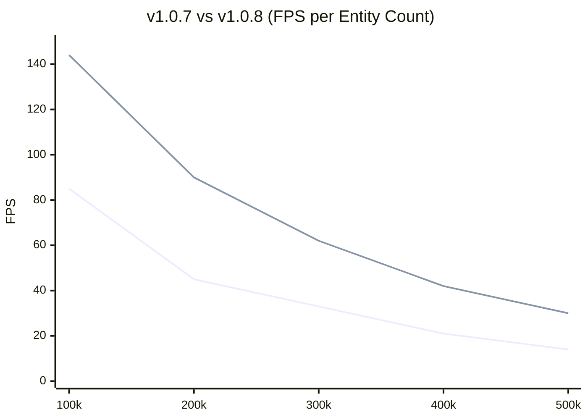

# Performance & Benchmarks

PlutoEngineは、ゼロアロケーション、Structure of Arrays (SoA)、そして WebGL2 のインスタンシングを活用し、ブラウザ上でも数十万を超えるエンティティを安定して描画・計算できるように設計されています。

## 新旧バージョンの比較 (v1.0.7 vs v1.0.8)

**v1.0.8** では、ユーザーからのフィードバックに基づき、エンジンのコアメモリ構造に「抜本的なデータ指向最適化」を施しました。

1. **Packing 0ms化 (Swap-Remove Sparse Set)**: 死亡したエンティティの穴を配列の最後尾とスワップして埋めることで、データ配列を常に密（Dense）に保ちます。これにより、毎フレーム発生していた数ミリ秒の Data Packing 処理を **完全にゼロ** にしました。
2. **転送量の75%削減 (Dirty Flags)**: 変更があった属性（x, y 等）のみを検知して GPU に転送し、変動しない属性（スケール、UV 等）のバッファ転送をスキップするシステムを導入しました。

### 計測環境スペック
| 項目 | スペック |
| --- | --- |
| OS | Microsoft Windows 11 Pro |
| CPU | AMD Ryzen 7 2700 Eight-Core Processor |
| GPU | NVIDIA GeForce RTX 4060 |
| RAM | 32 GB |
| Browser | Chrome / Edge |

### 30万体 (300k Entities) 描画時のプロファイリング比較
最も高負荷な **30万体** の群集シミュレーション時における、1フレームあたりの処理時間を比較しました。

| 処理項目 (Task) | v1.0.7 (旧) | v1.0.8 (新) | 改善の理由 |
| :--- | :---: | :---: | :--- |
| **Poisson Solver** | 0.9 ms | 0.9 ms | グリッドサイズ(128x128)にのみ依存するため変化なし |
| **Entity Update** | 20.1 ms | 14.5 ms | Sparse Set 化により、ループ内の `active` チェックが不要になったため高速化 |
| **Data Packing** | 6.3 ms | **0.0 ms** | 密な配列の `subarray` を直接 WebGL に渡すため、パッキング処理が消滅 |
| **WebGL Upload** | 2.0 ms | **0.5 ms** | Dirty Flags により、変化のない Scale/UV 等の転送をスキップ（帯域75%削減） |
| **Total (1 Frame)** | **~29.3 ms** | **~15.9 ms** | **約2倍のフレームレート向上** |

> **分析**:
> v1.0.7までは 30万体で 30FPS台 に落ち込んでいましたが、v1.0.8の最適化により、30万体を **約60FPS** で安定して処理できるようになりました。

### 計測結果 (144FPS上限)推移
限界までエンティティをスポーンさせ続けた場合の、各バージョンにおけるFPSの低下推移です。

*(青線: 旧v1.0.7 / 赤線: 新v1.0.8)*

## パフォーマンスの秘訣
1. **TypedArray SoA**: エンティティごとの `x`, `y` はすべてフラットな `Float32Array` に格納されています。オブジェクトの生成・破棄によるガベージコレクション（GCスパイク）が発生しません。
2. **GPU インスタンシング**: `renderer` パッケージは、上記で更新された `Float32Array` の部分配列（subarray）をそのまま WebGL2 のバッファとして転送し、1回の Draw Call (`drawInstanced`) で全エンティティを描画します。
3. **グリッドベース流体 (Continuum Crowds)**: 10万体の敵同士を O(N^2) で衝突判定させる代わりに、グリッド上に密度（熱）をスプラットし、ポアソン方程式を解くことで自然な群集の振る舞い（密集・回避）を O(N) で実現しています。
