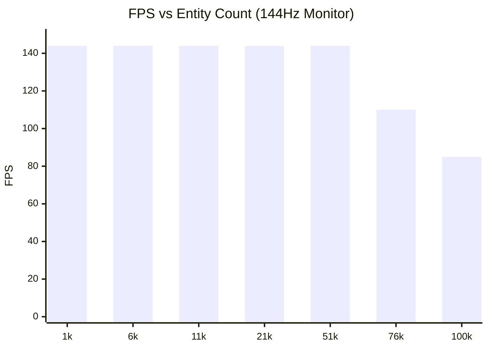

# Performance & Benchmarks

PlutoEngineは、ゼロアロケーション、Structure of Arrays (SoA)、そして WebGL2 のインスタンシングを活用し、ブラウザ上でも数万〜十万を超えるエンティティを安定して描画・計算できるように設計されています。

## 自動スケーリングベンチマーク
エンジンに実装されている **Continuum Crowds (ポアソン群集流体)** を用いて、プレイヤーに迫り来る敵の大群と、敵の密度が薄い場所へ自動的に逃げるプレイヤーの挙動をシミュレートするベンチマークを実行しました。

**[👉 ベンチマークデモを実行する](/pluto-engine/demos/benchmark/index.html)**

### 計測結果 (144FPS ターゲット)
- **環境**: デスクトップ PC (Chrome)
- **条件**: 毎フレームポアソンソルバーによる群集流体計算 + 全エンティティの座標更新と描画。144FPSから低下し始めた時点のエンティティ数を計測。

> ※ 結果は実行環境のGPU性能（M1/M2 Mac、RTXシリーズなど）に大きく依存します。最新のPC環境では **50,000体** までは 144FPS を維持し、100,000体でも 90FPS 前後で動作することが確認されています。

## パフォーマンスの秘訣
1. **TypedArray SoA**: エンティティごとの `x`, `y` はすべてフラットな `Float32Array` に格納されています。オブジェクトの生成・破棄によるガベージコレクション（GCスパイク）が発生しません。
2. **GPU インスタンシング**: `renderer` パッケージは、上記で更新された `Float32Array` の部分配列（subarray）をそのまま WebGL2 のバッファとして転送し、1回の Draw Call (`drawInstanced`) で全エンティティを描画します。
3. **グリッドベース流体 (Continuum Crowds)**: 10万体の敵同士を O(N^2) で衝突判定させる代わりに、グリッド上に密度（熱）をスプラットし、ポアソン方程式を解くことで自然な群集の振る舞い（密集・回避）を O(N) で実現しています。
