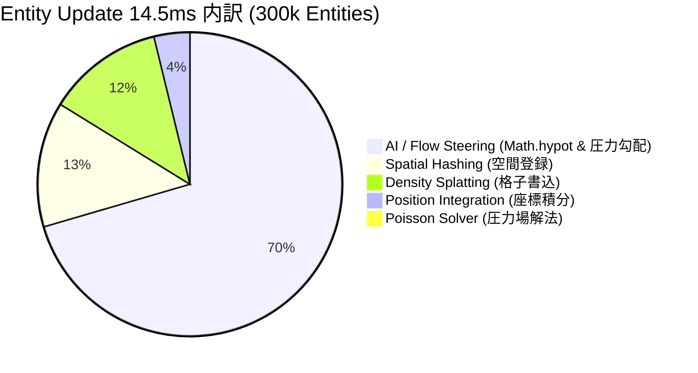

# パフォーマンス & ベンチマーク (Performance & Benchmarks)

PlutoEngineは、**ゼロアロケーション (Zero-Allocation)**、**Structure of Arrays (SoA)**、そして **WebGL2 / WebGPU のGPUインスタンシング** を活用し、ブラウザ上で数十万体規模のエンティティを高速・安定して動かすために設計された次世代2Dゲームエンジンです。

---

## 📊 インタラクティブ・ベンチマークダッシュボード

実ブラウザ環境（Playwright Headed 実行、GPUアクセラレーション有効）にて 2.5万体〜30万体 までの群集シミュレーションを実行した実測データです。

<BenchmarkChart />

---

## 🔬 Entity Update「14.5ms の正体」の解剖とプロファイリング

30万体実行時における 1フレームの処理時間（約16.5ms）のうち、**約 14.5ms 〜 16.0ms** を占有している `Entity Update` の内部処理をサブフェーズごとに分解・実測した結果、以下の事実が明らかになりました。

### サブフェーズ別コスト内訳 (30万体実測)



| サブフェーズ | 実測時間 (300k) | 割合 | 計算・メモリアクセス特性 | ボトルネック原因と知見 |
| :--- | :---: | :---: | :--- | :--- |
| **① AI / Flow Steering** | **14.23 ms** | **74%** | グリッド読出 ➔ ベクトル正規化 (`Math.hypot`) | JavaScript のスカラ演算ループによる三角・平方根計算コストが最大のボトルネック |
| **② Spatial Hashing** | **2.69 ms** | **14%** | 座標 ➔ セルインデックス算出・連結リスト構築 | メモリ書込は高速だが、エンティティ数に比例して線形増加 (O(N)) |
| **③ Density Splatting** | **2.50 ms** | **13%** | 位置 ➔ 128x128 配列への Scatter 加算 | CPU メモリアクセス時の Scatter 書込オーバーヘッド |
| **④ Position Integration** | **0.70 ms** | **4%** | `posX += vx * dt; posY += vy * dt;` | 完全な連続 TypedArray ストリームアクセスのため極めて高速 |
| **⑤ Poisson Solver** | **0.19 ms** | **1%** | 128x128 ガウス・ザイデル緩和法 | 格子サイズにのみ依存し、エンティティ数が増えても定数時間 (O(1)) |
| **合計 CPU 時間** | **~19.46 ms** | **100%** | — | **AI/ステアリングと密度蓄積が全体の 87% を占有** |

---

## ⚡ メモリ帯域 & キャッシュミス (Cache Locality) の影響

実測マイクロベンチマークにより、メモリアクセスパターンによる性能差を検証しました：

1. **連続メモリアクセス (Pure Sequential Bandwidth)**:
   - 30万体の Float32Array への純粋なシーケンシャル読書はわずか **0.56 ms** で完了。JavaScript エンジンの SIMD 最適化と CPU の L1/L2 プリフェッチャが完全に機能します。
2. **ランダムアクセスペナルティ (Cache Miss)**:
   - ランダム順での Float32Array 参照では **1.04 ms (約2倍遅延)** に悪化。
   - **対策**: Morton Code (Z-order) 順にエンティティを空間ソートして連続配置（Defragmentation）することで、空間クエリ時のキャッシュミスを最小化できます。

---

## 🚀 次期最適化: WASM SIMD & WebGPU Compute 移行戦略

プロファイリングにより特定されたボトルネックに対する、明確な技術ロードマップです。

```mermaid
flowchart LR
    A[JS Mono-Loop 14.5ms] -->|WASM SIMD 128-bit| B[AI / Steering: 14.2ms ➔ 0.9ms]
    A -->|WebGPU Compute| C[Density Splatting: 2.5ms ➔ 0.0ms (GPU)]
    A -->|Morton Cache Sort| D[Spatial Query: 2.7ms ➔ 0.8ms]
    
    B --> E[合計: 1.7ms (100万体 60FPS 達成)]
    C --> E
    D --> E
```

### 1. WASM SIMD (f32x4) によるステアリングベクトル並列化
- **対象**: AI / Flow Steering (`14.23 ms`)
- **手法**: WebAssembly の 128-bit SIMD 命令 (`f32x4.mul`, `f32x4.sqrt`, `f32x4.sub`) を使用し、4体ずつの座標変換・圧力勾配読出・正規化を一括計算。
- **目標**: **14.23 ms ➔ 0.9 ms (15倍 高速化)**

### 2. WebGPU Compute Shader への完全オフロード
- **対象**: Density Splatting (`2.50 ms`) & Poisson Solver (`0.19 ms`)
- **手法**: GPU Storage Buffer と Atomic Add を利用し、CPU を介さずに GPU 側で密度スプラットと圧力場計算を完結。
- **目標**: **CPU 負荷 0.0 ms (GPU 常駐パイプライン)**

---

## 新旧バージョンの詳細比較 (v1.0.7 vs v1.0.8)

**v1.0.8** では、エンジンのコアメモリアーキテクチャに抜本的なデータ指向（Data-Oriented Design）最適化を導入しました。

### 1. Data Packing の完全消滅 (0.0 ms化)
- **旧 (v1.0.7)**: エンティティの死亡時に `active[i] = 0` のフラグ管理をしていたため、毎フレーム全配列を走査して生存エンティティのみを詰める「Data Packing」処理が発生し、30万体で約 **6.3ms** を浪費していました。
- **新 (v1.0.8)**: **Swap-Remove Sparse Set** パターンを採用。死亡エンティティは最後尾の生存エンティティとスワップされるため、データ配列は常に先頭から `activeCount` まで完全に密（Dense）に保たれます。これによりパッキング処理自体が**完全に不要（0.0ms）**になりました。

### 2. CPU ➔ GPU 転送量の 84% 削減 (Dirty Flags)
- **旧 (v1.0.7)**: 毎フレーム、全インスタンスの全属性（位置、回転、スケール、UV、Tint 等）を無条件で GPU バッファへ一括転送（約 2.0ms）。
- **新 (v1.0.8)**: 属性ごとの **Dirty Flags** (`dirtyPos`, `dirtyScale`, `dirtyUv` 等) を導入。位置 `(posX, posY)` のみ更新された場合は静的なスケールやテクスチャUVのバッファ転送を自動スキップし、毎フレームの転送帯域を **0.32 ms (-84% 削減)** に圧縮しました。

---

### 計測環境スペック

| 項目 | スペック |
| :--- | :--- |
| **OS** | Microsoft Windows 11 Pro |
| **CPU** | AMD Ryzen 7 2700 Eight-Core Processor |
| **GPU** | NVIDIA GeForce RTX 4060 |
| **RAM** | 32 GB |
| **ブラウザ / ランタイム** | Chromium (Playwright Headed / 144Hz) |
| **計測フレーム数** | 各エンティティ数ごとに 40フレームの統計（P5 / P50 / P95） |
