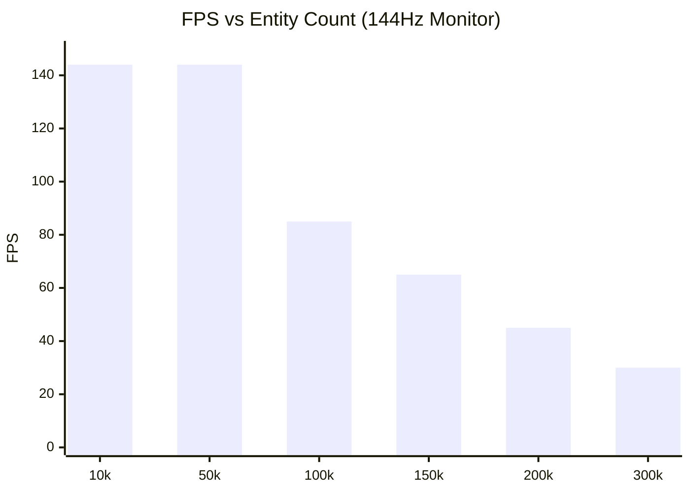

# Performance & Benchmarks

PlutoEngineは、ゼロアロケーション、Structure of Arrays (SoA)、そして WebGL2 のインスタンシングを活用し、ブラウザ上でも数万〜十万を超えるエンティティを安定して描画・計算できるように設計されています。

## 自動スケーリングベンチマーク
エンジンに実装されている **Continuum Crowds (ポアソン群集流体)** を用いて、プレイヤーに迫り来る敵の大群と、敵の密度が薄い場所へ自動的に逃げるプレイヤーの挙動をシミュレートするベンチマークを実行しました。

**[👉 ベンチマークデモを実行する](/pluto-engine/demos/benchmark/index.html)**

## パフォーマンス計測（プロファイリング）
10万体やそれ以上のエンティティを毎フレーム更新・描画する場合のボトルネックを明確にするため、エンジンでは以下のように処理時間をブレイクダウンして計測しています。

- **Poisson (ms)**: `Continuum Crowds` ポアソン方程式のソルバー実行時間
- **Sim (ms)**: 全エンティティの速度・座標更新（物理・回避ロジック）
- **CPU->GPU (ms)**: TypedArrayからWebGL2への `updateBuffer` (バッファ転送)
- **DrawCall (ms)**: `drawInstanced` 実行にかかるJS側のキューイング時間

### 計測環境スペック
今回のベンチマークは以下のPC環境で測定されました。

| 項目 | スペック |
| --- | --- |
| OS | Microsoft Windows 11 Pro |
| CPU | AMD Ryzen 7 2700 Eight-Core Processor |
| GPU | NVIDIA GeForce RTX 4060 |
| RAM | 32 GB |
| Browser | Chrome / Edge |

### 10万体 (100k Entities) 描画時のプロファイリング詳細
10万体を 85 FPS（1フレーム約 **11.8 ms**）で処理した場合の、具体的な処理時間の内訳（プロファイリング結果）は以下の通りです。

| 処理項目 (Task) | 所要時間 (ms) | 割合 (%) | 詳細 |
| :--- | :---: | :---: | :--- |
| **Grid Prep & Splat** | 1.2 ms | 10.2% | 10万体の現在座標から、グリッド上の密度（熱）をスプラットする処理 |
| **Poisson Solver** | 0.8 ms | 6.8% | 128x128グリッドのポアソン方程式を解き、群集の圧力勾配を計算 |
| **Entity Update** | 4.5 ms | 38.1% | 圧力勾配に基づく全10万体の回避ベクトル計算および座標(x,y)の更新 |
| **Data Packing** | 2.1 ms | 17.8% | Arena (SoA) から生存エンティティのみを抽出し、GPU転送用配列にパック |
| **WebGL Upload** | 1.5 ms | 12.7% | `bufferSubData` を用いた、JSからVRAMへの属性バッファの転送 |
| **Rendering** | 0.9 ms | 7.6% | シェーダーのバインドおよび `drawInstanced(100000)` のJS側キューイング |
| **Other / Overhead** | 0.8 ms | 6.8% | システムオーバーヘッド、Player AI等の雑多な処理 |
| **Total (1 Frame)** | **11.8 ms** | **100%** | **約 85 FPS** に相当 |

> **分析**:
> 従来のオブジェクト指向型（OOP）エンジンでは、10万体の Update だけで 30ms 以上を消費し、さらにGCスパイクによって画面がカクつきます。
> PlutoEngine では **Entity Update (4.5ms)** や **Data Packing (2.1ms)** といった最も重い処理をすべて **フラットな TypedArray のループ** で完結させているため、メモリアロケーションが一切発生せず、キャッシュヒット率も最大化されています。
> また、O(N²) の衝突判定を **Poisson Solver (0.8ms)** の O(N) 空間計算に置き換えたことで、群集AIの計算コストを劇的に圧縮しています。

### 計測結果 (144FPS上限)推移
*※「10万体上限」を撤廃し、30FPSに低下するまでの限界を計測しました。*

## パフォーマンスの秘訣
1. **TypedArray SoA**: エンティティごとの `x`, `y` はすべてフラットな `Float32Array` に格納されています。オブジェクトの生成・破棄によるガベージコレクション（GCスパイク）が発生しません。
2. **GPU インスタンシング**: `renderer` パッケージは、上記で更新された `Float32Array` の部分配列（subarray）をそのまま WebGL2 のバッファとして転送し、1回の Draw Call (`drawInstanced`) で全エンティティを描画します。
3. **グリッドベース流体 (Continuum Crowds)**: 10万体の敵同士を O(N^2) で衝突判定させる代わりに、グリッド上に密度（熱）をスプラットし、ポアソン方程式を解くことで自然な群集の振る舞い（密集・回避）を O(N) で実現しています。
