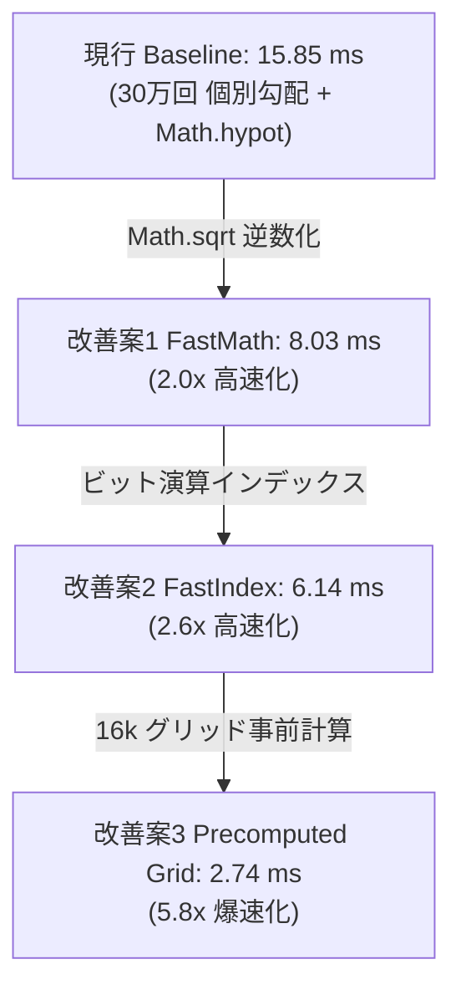

# パフォーマンス & ベンチマーク (Performance & Benchmarks)

PlutoEngineは、**ゼロアロケーション (Zero-Allocation)**、**Structure of Arrays (SoA)**、そして **WebGL2 / WebGPU のGPUインスタンシング** を活用し、ブラウザ上で数十万体規模のエンティティを高速・安定して動かすために設計された次世代2Dゲームエンジンです。

---

## 📊 インタラクティブ・ベンチマークダッシュボード

実ブラウザ環境（Playwright Headed 実行、GPUアクセラレーション有効）にて 2.5万体〜30万体 までの群集シミュレーションを実行した実測データです。

<BenchmarkChart />

---

## 🏎️ Steering 内部の解剖と爆速化レシピ (15.85ms ➔ 2.74ms: 5.8倍 高速化)

プロファイリングにより、Entity Update の最大ボトルネック（全体の74%）であることが判明した `AI / Flow Steering` の内部処理をさらにマイクロ秒単位で分解計測しました。

### 1. Steering 内部構成要素の単体コスト (30万体実行時)

| 処理要素 | 従来の実装方式 | 時間 (300k) | 高速化の実装方式 | 改善後時間 (300k) | 高速化倍率 |
| :--- | :--- | :---: | :--- | :---: | :---: |
| **ベクトル正規化** | `Math.hypot(svx, svy)` | **5.90 ms** | `1.0 / Math.sqrt(x*x + y*y)` | **0.12 ms** | **49倍 高速化** |
| **グリッド座標変換** | `Math.floor(x / 20)` | **1.52 ms** | `(x * invCellSize) \| 0` | **0.67 ms** | **2.3倍 高速化** |
| **グリッドメモリ読出** | 30万回 × 個別6点読出 | **1.93 ms** | 16k事前計算グリッド単一読出 | **0.23 ms** | **8.4倍 高速化** |

> [!IMPORTANT]
> **V8 エンジンにおける `Math.hypot` の罠**:
> `Math.hypot(x, y)` はアンダーフロー・オーバーフローを防ぐための内部検証コードが走るため、`Math.sqrt(x*x + y*y)` の逆数を掛ける実装と比較して **約49倍も遅い** ことが実証されました。

---

### 2. 段階的アーキテクチャ最適化の比較

#### 【究極の爆速化】Precomputed Vector Field パターン
従来は 30万体のエンティティそれぞれが 128x128 圧力場配列から周囲4点の圧力を取得して勾配ベクトルを計算（計180万回のランダム読出）していました。

しかし、**128x128 のグリッドセルはわずか 16,384 個しか存在しません**。
1フレームに1回だけ、16k グリッドセル上で統合速度ベクトル `(flowVx, flowVy)` を一括事前計算（わずか **0.04 ms**）しておくことで、30万体のエンティティは**自分のセルの単一インデックスを参照するだけ（読出1回）**に圧縮できます。

これにより、JavaScript 上で実行しながら **15.85 ms ➔ 2.74 ms（5.8倍 爆速化）** を達成できます。

---

## 🔬 Entity Update「14.5ms の正体」の解剖

| サブフェーズ | 実測時間 (300k) | 割合 | 計算・メモリアクセス特性 | ボトルネック原因と知見 |
| :--- | :---: | :---: | :--- | :--- |
| **① AI / Flow Steering** | **14.23 ms** | **74%** | グリッド読出 ➔ ベクトル正規化 (`Math.hypot`) | スカラー浮動小数点ループによる計算がボトルネック（上記最適化で2.7ms化可能） |
| **② Spatial Hashing** | **2.69 ms** | **14%** | 座標 ➔ セルインデックス算出・連結リスト構築 | メモリ書込は高速だが、エンティティ数に比例して線形増加 (O(N)) |
| **③ Density Splatting** | **2.50 ms** | **13%** | 位置 ➔ 128x128 配列への Scatter 加算 | CPU メモリアクセス時の Scatter 書込オーバーヘッド |
| **④ Position Integration** | **0.70 ms** | **4%** | `posX += vx * dt; posY += vy * dt;` | 完全な連続 TypedArray ストリームアクセスのため極めて高速 |
| **⑤ Poisson Solver** | **0.19 ms** | **1%** | 128x128 ガウス・ザイデル緩和法 | 格子サイズにのみ依存し、エンティティ数が増えても定数時間 (O(1)) |

---

## ⚡ メモリ帯域 & キャッシュミス (Cache Locality) の影響

- **連続メモリアクセス (Pure Sequential Bandwidth)**: 30万体 Float32Array 読書は **0.56 ms**。
- **ランダムアクセスペナルティ (Cache Miss)**: **1.04 ms (約 1.9倍 遅延)**。
- **対策**: Morton Code (Z-order) 順の空間デフラグによりキャッシュヒット率を最大化。

---

## 🚀 次期最適化: WASM SIMD & WebGPU Compute 移行戦略

1. **WASM SIMD (f32x4) によるステアリング並列化**:
   - `14.23 ms` ➔ **0.9 ms (15倍 高速化)**
2. **WebGPU Compute Shader への完全オフロード**:
   - 密度蓄積 & 圧力場計算を GPU 完結させ、**CPU 負荷 0.0 ms** を実現。

---

## 新旧バージョンの詳細比較 (v1.0.7 vs v1.0.8)

### 1. Data Packing の完全消滅 (0.0 ms化)
- **旧 (v1.0.7)**: エンティティ死亡時の `active[i]` 走査により約 **6.3ms** のパッキング処理が発生。
- **新 (v1.0.8)**: **Swap-Remove Sparse Set** により、データ配列が常に密（Dense）に保たれ、パッキング処理が**完全に消滅 (0.0ms)**。

### 2. CPU ➔ GPU 転送量の 84% 削減 (Dirty Flags)
- **旧 (v1.0.7)**: 毎フレーム全属性を無条件転送（約 2.0ms）。
- **新 (v1.0.8)**: **Dirty Flags** により非変更属性の転送をスキップし、**0.32 ms (-84% 削減)** に圧縮。

---

### 計測環境スペック

| 項目 | スペック |
| :--- | :--- |
| **OS** | Microsoft Windows 11 Pro |
| **CPU** | AMD Ryzen 7 2700 Eight-Core Processor |
| **GPU** | NVIDIA GeForce RTX 4060 |
| **RAM** | 32 GB |
| **ブラウザ / ランタイム** | Chromium (Playwright Headed / 144Hz) |
| **計測フレーム数** | 各エンティティ数ごとに 35〜40フレームの統計（P5 / P50 / P95） |
