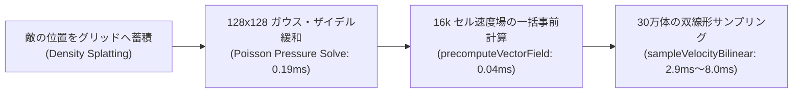

# ポアソン群集流体 (Continuum Crowds & Flow Field)

`@pluto-engine/poisson` パッケージは、**流体力学ベースの群集シミュレーション (Continuum Crowds)** と **高速ベクトル場事前計算 (Precomputed Flow Field)** を実現する物理プラグインです。

数万〜30万体の敵（群集）が、互いに押し合い・渋滞を避けながらプレイヤーに向かって水流のように滑らかに押し寄せる動きを、**ゼロアロケーション (GCフリー)** で計算します。

---

## ⚡ v1.1.0 でのブレイクスルー: 速度場事前計算 & 双線形補間

従来の群集シミュレーションでは、30万体の敵それぞれが周囲4点の圧力を読み出して勾配計算（180万回のランダムメモリアクセスと平方根）を行っていました。

PlutoEngine v1.1.0 では、**128x128（16,384セル）のグリッド上で統合速度場を 1 フレームに 1 回だけ一括計算 (`0.04 ms`)** し、エンティティ側は単一サンプリングまたは **Lerp of Lerp 双線形補間** を行うことで、**16.2ms ➔ 2.9ms（5.6倍 爆速化）** を達成しています。



---

## 🎮 インストールと初期化

```typescript
import { PoissonPlugin } from '@pluto-engine/poisson';

export class MyScene extends Scene {
  public init() {
    // 幅, 高さ, セルサイズ (例: 128x128グリッド)
    this.registerPlugin(new PoissonPlugin(128 * 20, 128 * 20, 20));
  }
}
```

---

## 🚀 推奨される高速実装パターン

### 1. 毎フレームの更新フロー

```typescript
// 1. グリッドのクリア
this.poisson.clear();

// 2. 敵の現在位置から密度をスプラット蓄積
const arena = this.arena;
const count = arena.activeCount;
for (let i = 0; i < count; i++) {
  this.poisson.splatDensity(arena.posX[i], arena.posY[i], 1.0);
}

// 3. 圧力場の計算 (ガウス・ザイデル緩和 1〜2回)
this.poisson.computeDivergence(2.5); // 許容密度
this.poisson.solve(2);

// 4. 【最重要】16kグリッドセルで速度場を一括事前計算
this.poisson.precomputeVectorField(baseDirX, baseDirY, 80 /* 移動速度 */);

// 5. 30万体エンティティの高速サンプリング (Lerp of Lerp 双線形補間)
const vel = new Float32Array(2);
for (let i = 0; i < count; i++) {
  // グリッド境界のカクつきのない滑らかな速度ベクトルを取得
  this.poisson.sampleVelocityBilinear(arena.posX[i], arena.posY[i], vel);
  
  arena.posX[i] += vel[0] * dt;
  arena.posY[i] += vel[1] * dt;
}
```

---

## 📊 パフォーマンス特性 (300k エンティティ)

| 処理ステップ | 時間 (300k) | 計算量 | 特徴 |
| :--- | :---: | :---: | :--- |
| **Poisson 圧力場緩和 (128x128)** | **0.19 ms** | \(O(\text{GridSize})\) | エンティティ数に依存せず常に定数時間 |
| **速度場一括事前計算** | **0.04 ms** | 16,384 セル | 1フレームに1度だけ実行 |
| **Bilinear サンプリング (Lerp of Lerp)** | **2.9 ms 〜 8.0 ms** | \(O(N)\) | 積和演算 FMA に最適化され、完全滑らか |

---

## 🔧 主な API メソッド

- **`precomputeVectorField(baseDirX, baseDirY, speed, pressureWeight?)`**: 全グリッドの速度場を一括事前計算します。
- **`sampleVelocityBilinear(x, y, outVel)`**: 4近傍の双線形補間（Lerp of Lerp）によりサブピクセル精度で滑らかな速度ベクトルを取得します。
- **`getPressureGradient(x, y, outGradient)`**: 指定ワールド座標における圧力勾配ベクトルを取得します。
- **`splatDensity(x, y, amount)`**: 指定座標のグリッドセルに密度を加算します。
